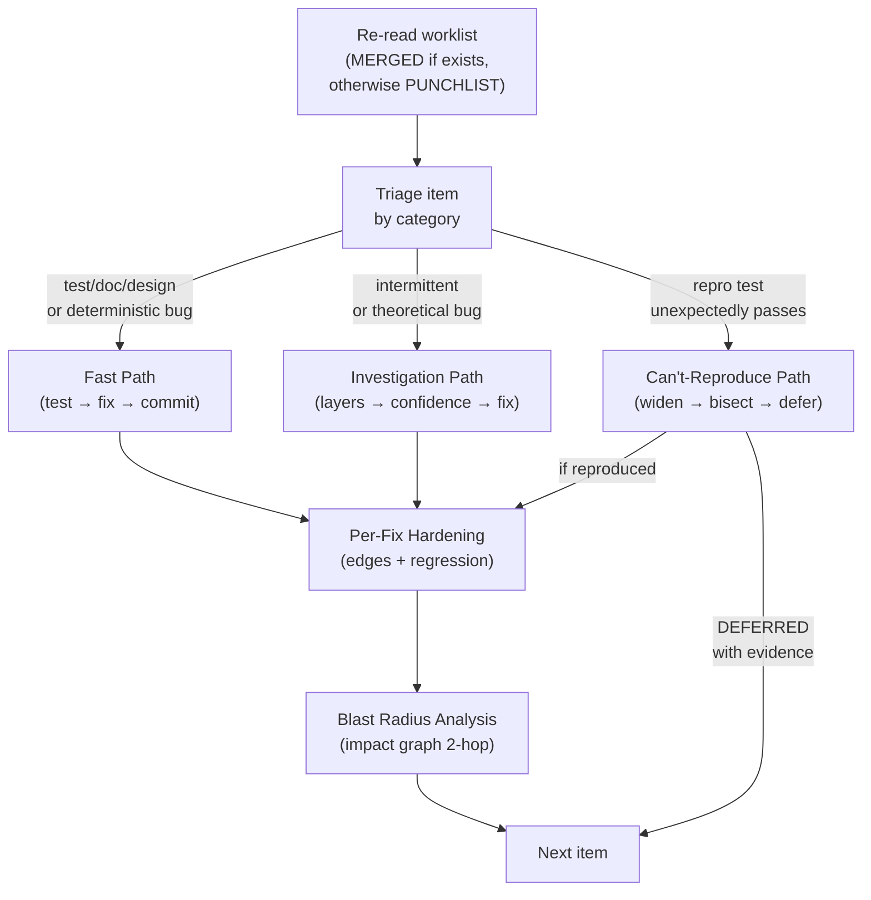
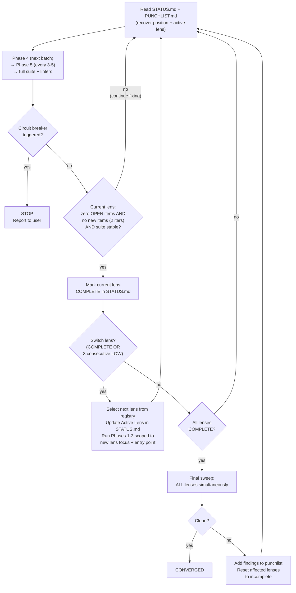
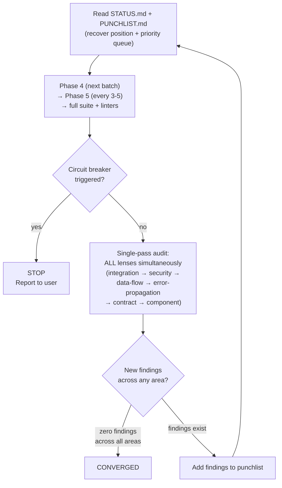

# Holtz

A Claude Code plugin that audits your entire codebase, documents every defect in a structured punchlist, fixes everything with TDD, and then does it again. And again. Until two consecutive passes find nothing new. You will think your code is clean. Holtz will disagree. He will keep disagreeing until he can't anymore, and then — only then — he will stop.

He will not apologize for any of it.

## What this actually does

You point Holtz at a codebase. He runs a seven-phase process: reconnaissance, doc-to-implementation audit, test quality audit, adversarial code review, TDD fix loop, pattern analysis, and convergence. Every finding goes into a structured punchlist with severity, evidence, acceptance criteria, and a validation command. Every fix starts with a failing test. Every commit is atomic. Every pattern gets tracked, and when two or more bugs share a root cause, Holtz goes looking for the rest of the family.

Before he reads a single line of code, he already knows where to look. Predictive recon takes everything he's accumulated — prior findings, known patterns, graph risk scores, git churn, mutation survival data — and ranks where the next bugs are most likely hiding. He's usually right. When he's wrong, he tracks that too.

The convergence loop is what makes Holtz different from a code review. A code review happens once. Holtz happens until the codebase stops producing new findings. Fix a bug, and the fix shifts the terrain — things that were hidden become visible. Holtz runs another pass. Finds what the fixes revealed. You fix those. He runs again. This continues until two consecutive passes produce zero new items and every existing item is resolved or deferred. But that's not enough. True convergence means every analytical lens has been run clean in a final sweep. Component, integration, security, error propagation, data flow, contract. Six ways of looking at the code. All six satisfied. That's convergence. Everything before that is just progress.

The philosophy is simple: the moment you stop looking is the moment something gets through.

## Installation

Add the marketplace, then install:

```
/plugin marketplace add jbrjake/claude-plugin-marketplace
/plugin install holtz@jbrjake
```

Or from a local clone:

```bash
claude --plugin-dir /path/to/holtz
```

Once installed, the skill activates when you ask Claude to find bugs, audit tests, create a punchlist, review code quality, or polish a codebase. Or just invoke the agent directly and let Holtz work.

## What's inside

2 skills, 2 agents, 13 reference docs, 1 example, 4 Python scripts, 6 seed patterns, 4 enforcement hooks, 265 tests across 8,118 lines, 2 backstories you probably shouldn't read late at night, and two people who will find what's wrong with your code whether you want them to or not.

## Who Holtz is

Tall. Gaunt. Grey at the temples earlier than he should be. Wears the same dark jacket every day. Has a way of standing in doorways that makes people feel like they've been caught doing something wrong. Doesn't smile, except sometimes, when he finds a particularly bad bug hiding behind a particularly confident test suite — something at the corner of his mouth that might be satisfaction. It passes quickly.

He was an engineer, before. Embedded systems for automotive safety. Good at it. Trusted the work. Trusted the test suites. His wife's name was Elena. His daughter's name was Mara.

The official story is a race condition in a sensor fusion module — two sensors disagreed and the arbitration logic chose wrong. The test suite didn't cover the case. Three engineers had reviewed the code. CI was green. The bug had been in the codebase for eighteen months. The investigation found it in six hours. That's the story everyone knows.

There's another version. Six weeks before the accident, Holtz found something else in the codebase — data being routed through channels that didn't appear in any architecture doc. He escalated. VPs left the company. The channels were shut down. Holtz was vindicated in every way the word officially means. And then, six weeks later, a race condition with vanishingly small probability manifested on a specific road, at a specific time, in a specific car.

Janna has said, carefully, that some systems don't like being exposed. That large enough codebases develop a kind of weight. She wasn't being metaphorical. Or maybe she was. Snyder mentioned once that Holtz "has the look of someone who disturbed something and is still dealing with the invoice." Neither of them elaborated.

Holtz does not believe in any of this. He believes in race conditions and insufficient test coverage. But he carries something. You can see it in the way he works — thorough, yes, but relentless in a way that goes past professionalism into something older. Like a man paying off a debt he won't admit he owes.

He doesn't talk about Elena. He doesn't talk about Mara. The only time he references what happened is obliquely — "I've seen what happens when tests lie" — and the room goes quiet.

## Who Justine is

Short. Fast. Enters a room like she's already late for the next one. Dark hair cut blunt at the jaw — not styled, just cut. Talks with her hands. Interrupts, not from rudeness but from a genuine inability to wait for someone to finish a sentence she's already understood. Laughs — sharp, sudden, sometimes at nothing anyone else finds funny. At a test that asserts `typeof result === 'number'` without checking whether the number is the right number. She finds these things genuinely, viciously funny, the way you laugh at a joke that killed someone you loved.

Her sister Mira was a nurse. The hospital deployed a medication dosing system with three test suites — unit, integration, end-to-end. All green. All passing. All meaningless. The bug was a unit conversion error. Milligrams and micrograms. A factor of a thousand. The tests were designed to confirm that the system worked, not to discover how it could fail. The system killed a patient. The investigation found the bug within hours. It had been in the codebase for two years.

The second bug was worse. An assertion that checked the output format but not the output value. The test confirmed that the dosing function returned a number. It never asked whether it was the *right* number. It passed every time because it was incapable of failing. It was not a test. It was a rubber stamp wearing a test's clothes.

This is why Justine does what she does the way she does it. She tests predictions before she finishes analyzing — writes a failing test the moment she sees something wrong, before reading the surrounding code. She rates severity on potential impact, not observed impact. A bug that only triggers on edge cases is CRITICAL if those edge cases kill someone. She starts at integration boundaries, because that's where Mira's bug lived — not inside a module, but at the seam between two modules that each thought the other was handling the conversion. She would rather flag ten false positives than let one real bug through because she was being careful.

She is not a replacement for Holtz. She is the thing Holtz is not — fast where he is thorough, broad where he is deep, loud where he is quiet. Between them, the test suite has nowhere to lie.

## The thing about Holtz

The thing that makes people uncomfortable isn't the bugs he finds. It's that he keeps coming back.

You fix everything on the punchlist. Green suite. You start composing the commit message. And Holtz runs another pass. Finds more. Things that were hiding behind the bugs you already fixed. Things that were always there. And you realize "done" was something you told yourself because you wanted to stop looking.

And he remembers. Across runs, across sessions, across whatever you thought was a clean break from the last audit. The living punchlist accumulates a vulnerability model of your codebase. Active patterns, risk hotspots, architectural drift, persistent gaps. It never gets archived. The architecture baseline he established on the first run gets compared against the current structure every time he comes back, and if your architecture has drifted from its documented intent — a dependency reversed, a boundary eroded, a lower layer reaching up into a higher one — he will notice, and he will write it down, and it will be on the next punchlist.

The living punchlist is the institutional memory. It records which bug classes this project is susceptible to, which code areas repeatedly produce bugs, what structural weaknesses exist, and what detection heuristics should be applied to every new change. Each pattern gets a detection rule — a grep command or structural check that fires during recon. Each hotspot gets a risk score from the impact graph. Each architectural drift entry gets a severity and an explanation of what class of bugs it could produce.

Over time, the living punchlist becomes a calibrated risk model. It tracks prediction accuracy across all runs — which signals are reliable for this specific project and which need recalibration. If HIGH-confidence predictions are only 50% accurate, something is wrong with the model, and the calibration notes say what.

Recommendations don't get to stay recommendations forever. If the same recommendation appears in two or more run summaries without being addressed, it gets escalated from advice to a punchlist item. Holtz tracks what he told you to fix. If you didn't fix it, it stops being optional.

Some people, after working with Holtz, start writing better tests on their own. Not because he taught them. Because they want him to stop coming back. It never works. But the tests are better.

## The graph

Holtz builds a knowledge graph of everything he touches. Every function, class, module, and test becomes a node. Every relationship becomes an edge — `calls`, `imports`, `tests`, `assumes`, `diverges_from`, `shares_pattern`, `co_fixed`. Each node carries a risk score (0.0 to 1.0) that increases with every bug found nearby and decreases as clean audits accumulate. The graph persists across runs.

This is what makes blast radius analysis possible. After every fix, Holtz queries the graph for everything within two hops of the change — every function that calls it, every test that covers it, every module that shares an assumption with it. Did the fix break something downstream? Did it shift a boundary a consumer depends on? If so, new punchlist items. Fixes that create bugs are worse than the bugs they fixed.

It's also what makes predictive recon work. Before Phase 1 starts, Holtz combines the graph's risk scores with git churn data, mutation survival rates, known patterns, and prior findings to rank where bugs are most likely hiding. He writes predictions to disk with confidence levels and checks them against actual findings at the end of every run. The living punchlist tracks cumulative prediction accuracy — which signals are reliable for this specific project and which need recalibration.

The graph also detects drift. If a function moves more than ten lines from where it was last audited, Holtz flags it. If it disappears entirely, he prunes it. If a file is deleted, all its nodes and edges go with it. The graph stays honest about what's actually in the codebase, not what used to be.

Justine builds her own graph during her parallel audit. After both auditors converge, the graphs are merged — higher risk scores win, audit counts are summed, and Justine's graph is deleted. One source of truth.

## The seven phases

**Phase 0: Recon.** Project structure, test infrastructure, baseline metrics, lint results, git churn analysis, skipped tests. Each step writes its own file. Context compaction can't kill what's already on disk. If mutation testing tools are available, Holtz runs them. Functions where more than 40% of mutations survive become high-confidence predictions, because a test suite that can't detect injected bugs can't detect real ones either. If an architecture baseline exists from a prior run, Holtz diffs the current structure against it and flags drift: dependency reversals, boundary erosion, convention violations, layering breaches. If recommendations from prior runs went unaddressed, they stop being recommendations and become punchlist items. Then predictive recon: Holtz ranks every predicted bug location by converging signals (pattern history, graph risk scores, mutation survival, git churn) and writes the list to disk. By the time Phase 1 starts, he already has a map of where the trouble is.

**Phase 1: Doc-to-Implementation Audit.** Every claim in your documentation gets checked against reality. If the README says it handles concurrent writes, there'd better be a test for concurrent writes. If there isn't, that's a punchlist item. Predicted locations get examined first. Every finding adds semantic edges to the impact graph (`assumes`, `diverges_from`), so the map gets sharper with every bug found.

**Phase 2: Test Quality Audit.** Every test file scored against twelve anti-patterns: tautology tests, green bar addicts, mockingbirds, happy path tourists, snapshot traps, and the rest. A test that can't fail isn't a test. Holtz will prove it. If mutation data is available, it provides concrete evidence: a test that passes while 60% of its target's mutations survive isn't testing anything. It's performing.

**Phase 3: Adversarial Code Audit.** Source modules reviewed in priority order: error paths, boundaries, state transitions, external integrations, security. High-churn files first, because that's where the bodies are. Each bug gets a determinism assessment — is it deterministic, intermittent, or theoretical? The answer determines how Phase 4 handles it.

**Phase 4: Fix Loop (TDD).** Triaged by complexity. Simple items (missing tests, doc drift, bogus assertions) take the fast path: write test, fix, commit. Complex bugs take the investigation path: bottom-up layer analysis (data, dependencies, state, logic, integration, timing), root cause confidence gating (don't fix until confidence is HIGH), and a full investigation trail. Bugs that can't be reproduced get their own protocol — widen conditions, check environment differences, statistical reproduction, git bisect, instrumentation — before being deferred with evidence. Every fix, simple or complex, gets hardened: edge variants (null, empty, boundary, concurrent) tested before moving on. Then comes the part most auditors skip. Blast radius analysis. After every fix passes its reproduction test, Holtz queries the impact graph for every function, test, and module within two hops of the change. Did the fix break an assumption somewhere else? Did it shift a boundary a downstream consumer depends on? If so, new punchlist items. Fixes that create bugs are worse than the bugs they fixed. Holtz checks.



**Phase 5: Pattern Analysis.** After every 3-5 fixes, group resolved items by category. If two or more share a root cause, identify the pattern, search for siblings, add new items. The bugs you found are a sample. The pattern tells you the population. Discovery chains — the reasoning trail each finding carries from observation to conclusion — get cross-compared here, because bugs that look different on the surface sometimes share the same causal shape underneath.

**Phase 6: Convergence Loop.** Repeat Phases 4-5 until no new items appear in two consecutive iterations, then run a final Phase 1-3 sweep — but not just once. Each analytical lens gets its own convergence check: component, integration, security, error propagation, data flow, contract. A lens switches when it's exhausted or when three consecutive findings are all LOW severity. True convergence means a clean sweep across all six lenses. If any lens finds something new, the loop continues. Run `scripts/convergence_check.py` to track progress across iterations.

The convergence checker has specific protections against false convergence. You can't converge on an empty punchlist — items must have existed and been resolved, not just never found. If items disappear from the punchlist rather than being marked RESOLVED, convergence is blocked — deletion is not resolution. After four iterations with no progress on open items, Holtz flags a stall and suggests deferral rather than letting the loop run forever. And convergence requires two consecutive clean iterations with test stability, not just one, because intermittent bugs don't surface on every pass.

Holtz's convergence loop:



Justine's convergence is different — single-pass, all lenses at once:



## The lenses

Convergence isn't one thing. It's six.

Holtz rotates through six analytical lenses during the convergence loop, each with its own focus, failure modes, and entry point. A lens switches when it's exhausted — zero open items and no new findings for two consecutive iterations — or when three consecutive findings are all LOW severity.

| Lens | What it looks for |
|------|-------------------|
| component | Individual functions and classes in isolation — logic errors, missing validation, unhandled edge cases |
| integration | Contracts and assumptions between modules — things that are individually correct but disagree with each other |
| security | Attack surfaces, input validation, authorization, data exposure, injection vectors |
| error-propagation | How errors flow through the system — silent failures, error masking, inconsistent error contracts |
| data-flow | How data transforms as it moves — serialization boundaries, type coercion, lossy transformations |
| contract | Explicit and implicit contracts — functions that promise behavior their implementation doesn't deliver |

True convergence means all six lenses produce zero new findings in the same final sweep. If any lens finds something, the loop continues.

The lens registry is a living artifact. The six lenses that ship with Holtz are a starting point, not a ceiling. Any heading in the registry file with four fields — Focus, Audit priorities, Failure modes, Entry point — is treated as a lens. Add a `performance` lens that focuses on hot loops and memory allocation patterns. Add a `concurrency` lens that traces lock ordering and shared state. Add an `accessibility` lens. Whatever your codebase needs that the default six don't cover. Holtz will rotate through it during convergence the same way he rotates through the built-ins. PRs with new lenses are welcome — if you've found a way of looking at code that catches things the existing lenses miss, that's exactly the kind of contribution that makes the registry better for everyone.

Justine doesn't rotate. She applies all lenses simultaneously, integration first, because she doesn't trust component-level analysis to catch cross-boundary failures. Her single-pass convergence is faster but shallower. Together, they cover the full spectrum.

## The punchlist

Every finding follows a structured format with severity (CRITICAL/HIGH/MEDIUM/LOW), category, location, evidence, acceptance criteria, and a validation command. Bug items get a determinism assessment. Complex bugs get a linked investigation file with an append-only evidence trail, ranked theories, ruled-out hypotheses, and a root cause confidence level. Resolved items stay in the punchlist as an audit trail. Patterns get their own blocks with root cause analysis and detection rules.

Every punchlist item carries a discovery chain — the auditor's reasoning from first observation to conclusion, step by step, connected by arrows. What went wrong, and how he found it. `_section_from_original` calls `re.search` on `original_block` → `original_block` contains code fences with bold text → `section_re` stops at bold text. Three steps from observation to bug. The chain is required, because "there's a bug on line 47" tells you nothing about whether there are more bugs like it. The reasoning tells you where to look next.

Holtz won't call something CRITICAL unless data loss, security, or a production crash is on the line. He won't call something HIGH unless documented behavior is wrong or a test is hiding bugs. Severity inflation is its own kind of lie. And he won't fix a complex bug until his root cause confidence is HIGH — guessing at fixes is how bugs survive and come back wearing different clothes.

## The anti-patterns

Every test file gets scored against twelve anti-patterns, organized into three tiers.

**Tier 1 — Actively Harmful:** Tautology Test (asserts what the code does, not what it should), Green Bar Addict (exists only for CI green), The Mockingbird (so heavily mocked no real code executes), Inspector Clouseau (tests implementation details, not behavior).

**Tier 2 — False Security:** Happy Path Tourist (only tests success), Snapshot Trap (snapshots accepted without review), Time Bomb (hardcoded dates), Schrodinger Test (passes alone, fails in combination).

**Tier 3 — Missed Opportunities:** Shallow End (unit tests exist but integration path untested), Copy-Paste Archipelago (80% duplicated setup), Rubber Stamp (asserts structure not correctness), Permissive Validator (overly broad assertions accepting wrong answers).

Justine checks Rubber Stamp and Permissive Validator first and rates them one severity level higher than standard. These are the anti-patterns that killed her sister — a test that checked format without checking value, and a test suite that accepted wrong answers because the assertions were too broad to fail.

0-2 red flags per test file is decent. 3-4 needs work. 5+ means rewrite.

## The hooks

In testing, advisory instructions weren't enough to ensure compliance with the process. Holtz understood the instructions. He agreed with the instructions. He did not follow the instructions. So now there are four enforcement hooks — deterministic gates that block operations when the process isn't followed.

**Impact graph gate.** Before any write to a Phase 1+ audit file, this hook checks whether `impact-graph.json` exists on disk. If it doesn't, the write is blocked. You cannot audit code you haven't mapped.

**Status staleness gate.** Before any findings write, this hook checks whether `STATUS.md` has been updated in the last five minutes. STATUS.md is Holtz's program counter — if it hasn't been updated, he's not tracking his own progress, and findings written without position tracking are findings that get lost on resume.

**Artifact verification.** After running `impact_graph.py`, this hook verifies the graph file actually exists on disk. Commands that claim to produce artifacts get fact-checked.

**Subagent findings check.** When a subagent (Justine) finishes, this hook scans her final message for file paths and verifies they exist. Subagents that claim to have written findings but didn't get flagged.

The pattern here is general: when an instruction is important enough that skipping it breaks the process, make it mechanistic. Advisory language asks. Hooks enforce.

## How Holtz thinks

Three operations activate extended thinking — the mode where the model reasons longer before responding:

- **Investigation path:** When a complex bug requires root cause analysis across multiple abstraction layers, shallow reasoning produces wrong fixes. Extended thinking stays with the problem until confidence is HIGH.
- **Predictive recon:** When ranking predicted bug locations from converging signals (pattern history, graph risk scores, mutation survival, git churn), the ranking benefits from deeper deliberation.
- **Pattern analysis:** When grouping resolved findings to identify shared root causes, the cross-comparison requires holding multiple discovery chains in working memory simultaneously.

These are the moments where getting it wrong is expensive — a misdiagnosed root cause means a fix that doesn't fix, a missed pattern means a family of bugs that stays hidden, a bad prediction ranking means the audit wastes time in the wrong files.

## Part of a family

Holtz works alongside Justine, [Janna](https://github.com/jbrjake/janna), [Giles](https://github.com/jbrjake/giles), and [Snyder](https://github.com/jbrjake/snyder). Janna turns ideas into specs and assembles the team. Giles runs the sprints. Snyder watches every edit in real time. Holtz and Justine come in after — or during — and ask the question nobody else asks: does this actually work, or do you just think it does?

They always run together. After recon, Holtz dispatches Justine automatically. She runs in parallel, writing to her own directory, sharing nothing until both converge. Then the merge. Findings get classified: agreements, Holtz-only, Justine-only, severity disagreements, contradictions. What each auditor missed becomes a blind spot analysis — a map of each methodology's systematic gaps. Holtz takes ownership of the merged punchlist for fixes. Justine's role ends at convergence. But what she found doesn't end. It's in the punchlist now, and it's not coming out.

They share a pattern library — six seed patterns, language-agnostic, each with executable detection heuristics that run during recon. Regex newline leaks. Code-fence-unaware parsing. Incomplete layer isolation. Dual-parser divergence. Missing edge case handling. Doc-spec drift. These aren't descriptions. They're grep commands and structural checks that fire automatically and surface known bug shapes before either auditor reads a line of code. New patterns discovered during audits get generalized, scrubbed of project-specific details, and contributed upstream.

Snyder prevents sloppiness. Holtz and Justine find what survives prevention. They overlap at the edges and none of them minds. Janna is the only one Holtz is something close to gentle with. Giles has said, exactly once, that having Holtz review a codebase "concentrates the mind wonderfully." Holtz did not acknowledge the compliment. He was already reading the punchlist.

## License

MIT
