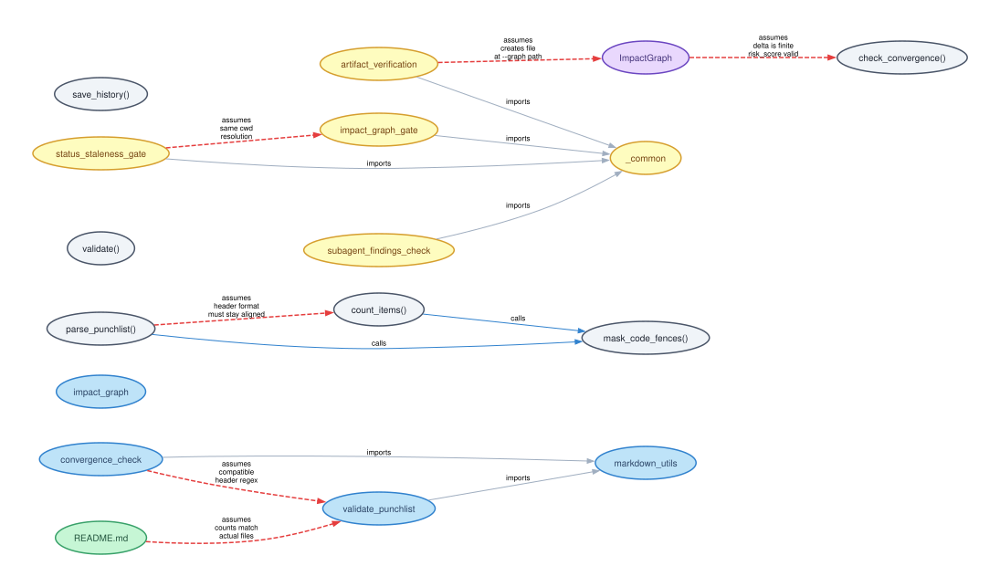
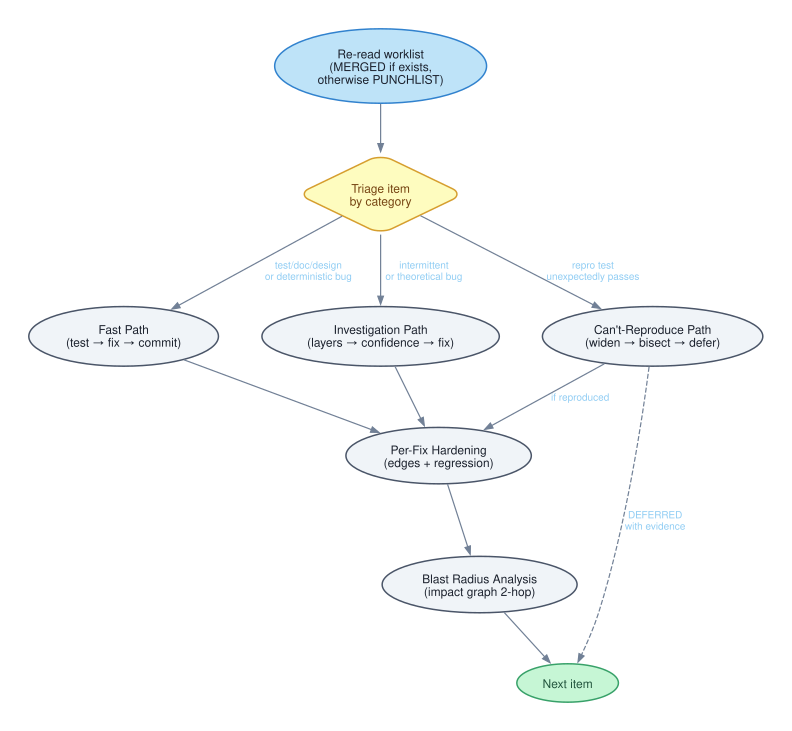
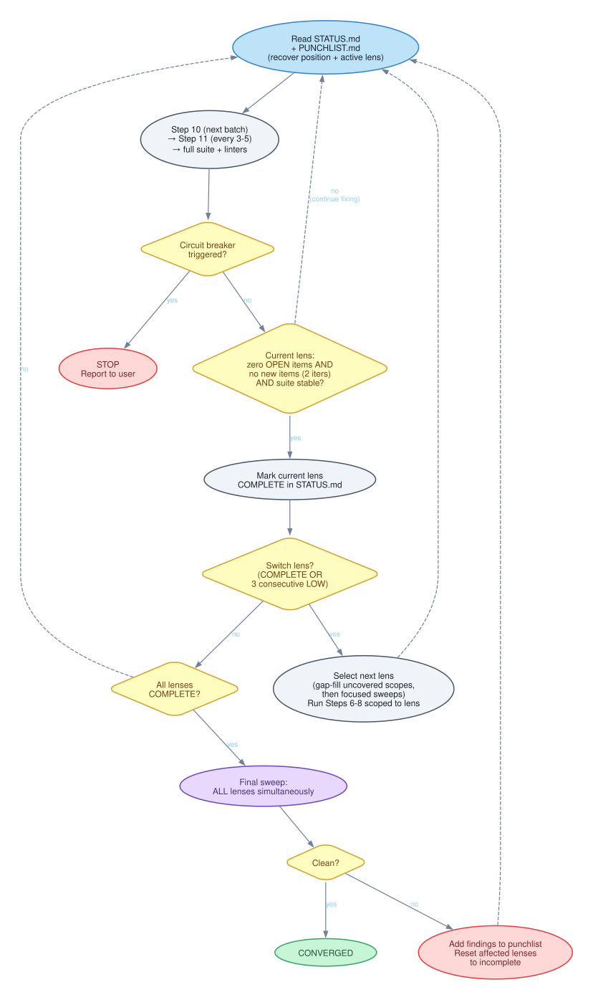
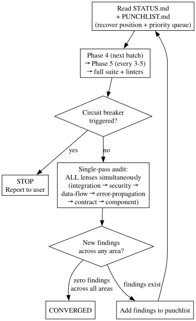
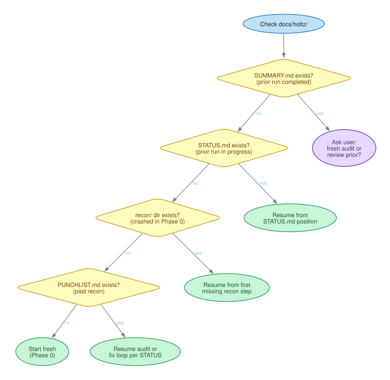

# Holtz

[](https://github.com/jbrjake/holtz/actions/workflows/ci.yml)
[](LICENSE)


**Adversarial TDD audit loop for Claude Code.** Dual auditors find bugs, write failing tests, fix them, and repeat until two consecutive passes find nothing new.

```
/plugin marketplace add jbrjake/claude-plugin-marketplace
/plugin install holtz@jbrjake
```

Or from a local clone: `claude --plugin-dir /path/to/holtz`

<p align="center">

[](https://asciinema.org/a/mFXtFyzeKqZnNgIy)

</p>

---

A Claude Code plugin that audits your entire codebase, documents every defect in a structured punchlist, fixes them with TDD, and then does it again. And again. Until two consecutive passes find nothing new. You will think your code is clean. Holtz will disagree. He will keep disagreeing until he can't anymore, and then he will stop.

He will not apologize for any of it.

He works with a second auditor named Justine, who runs in parallel using a different methodology. She's breadth-first where he's depth-first. They don't coordinate during the audit. They merge after, and what each one missed becomes a map of the other's blind spots.

## Why this exists

Code review happens once. The comments get addressed, the reviewer approves, everyone moves on. But fixing a bug changes the terrain. A fix in module A shifts an assumption in module B, and now there's a new bug that didn't exist ten minutes ago. Nobody goes back to check. The PR is merged. CI is green. The bug ships.

Holtz goes back to check.

He runs a twenty-one step audit and then starts over. Finds what the fixes uncovered. Fixes those too. Runs again. This continues until two consecutive passes produce zero new findings across thirteen analytical lenses. That's convergence. Everything before that is just progress.

The moment you stop looking is the moment something gets through.

The skill activates when you ask Claude to find bugs, audit tests, create a punchlist, review code quality, or polish a codebase. Or just tell Holtz to audit and get out of the way.

## What Holtz audits

Not just your code.

**Your documentation.** Every testable claim gets checked against reality. README says it handles concurrent writes? Where's the test. API docs say the endpoint returns 404 on missing resources? Prove it. If the docs promise something the code doesn't deliver, that's a punchlist item. If the docs say nothing about something the code does, that's a different punchlist item.

**Your tests.** Every test file scored against seventeen anti-patterns across three tiers. Tautology tests that assert what the code does instead of what it should do. Green bar addicts that exist to make CI green. Mockingbirds so heavily mocked that no production code actually executes. Rubber stamps that check structure without checking values. Permissive validators with assertions so broad they'd accept a wrong answer and smile about it. 0-2 red flags per file is decent. 3-4 needs work. 5+ means the test file is technically fiction.

**Your commit history.** Git churn from the last 50 commits. The 20 most-changed files get audited first, because code under pressure is code that breaks. Every `skip` and `xit` in the test suite is an admission of a gap. Holtz treats it as one.

**Your mutations.** If mutation testing tools are available, Holtz runs them. He injects faults into your code and checks whether the tests notice. A function where 40% of mutations survive has a test suite that can't detect 40% of possible bugs. That's not a test suite. That's a coin flip with better marketing.

**Your architecture.** On the first run, Holtz establishes a baseline: module dependencies, layering direction, naming conventions, boundary clarity. On every subsequent run, he diffs the current structure against it. Dependency reversals. Boundary erosion. A lower layer reaching up into a higher one. The kind of structural decay that makes bugs more likely even when no individual line of code is wrong.

**Your naming.** Whether the names in your code describe what actually happens at runtime. A state machine label called `PROCESSING` that gets applied after processing is finished. A function called `validate` that only checks one of three fields. An enum whose values drifted from their original meanings across six months of patches. The semantic-fidelity lens traces when each state is set and cleared across all callers and compares the temporal window against the name. If the name lies, that's a bug. A subtle one, but the kind that makes the next developer write the wrong code with full confidence.

**Your orchestration.** Whether multi-file workflows actually execute in the order they claim to. Phantom states entered and exited in the same code block. Exit-labeled transitions that fire after the work instead of before it. Protocol steps documented in one file but executed differently in another. The temporal-protocol lens picks a workflow spanning two or more files and traces the actual execution sequence step by step, asking at each state change what work happened since the last change and what remains before the next.

**Your README.** Whether user-facing documentation accurately describes runtime behavior. Install instructions that skip a required step. Feature claims about capabilities the code doesn't have. Capabilities the code does have that the README doesn't mention. The public-contract lens reads the README end to end and classifies every concrete claim as verified, overstated, fabricated, or understated. Aspirational documentation that describes what you intended instead of what you shipped is the most common finding. It's also the one people argue about the most.

## The graph

The graph is how Holtz thinks. Every function, class, module, and test in your codebase becomes a node. Every relationship becomes an edge. Seven defined edge types: `imports`, `calls`, `tests`, `assumes`, `diverges_from` — the five in active use — plus `shares_pattern` and `co_fixed` for pattern analysis and blast radius tracking. Each node carries a risk score (0.0 to 1.0) that increases with every bug found nearby and decreases as clean audits accumulate. The graph persists across runs.

The interesting edges are the semantic ones: `assumes` and `diverges_from`. These encode things that don't appear in any import statement or call stack. The implicit contracts between modules that nobody writes down and everybody violates.

Here is the actual impact graph from Holtz's own codebase. Blue nodes are modules. Gray are functions. Yellow are enforcement hooks. Purple is the ImpactGraph class. Green is documentation. Indigo nodes are test modules, with dotted purple lines showing what they cover. Solid lines are structural relationships (imports, calls). Dashed red lines are semantic assumptions — the places where a change in one module can silently break another. Dashed orange lines are divergences — where documentation and code have drifted apart.

<p align="center"></p>

That edge between `parse_punchlist` and `count_items` says: "Both split on `### BH-NNN:` headers in masked content — must stay aligned." Change how one of them splits headers, and the other breaks. No import. No call. Just a shared assumption about a markdown format that two functions parse independently. The graph knows about it. When Holtz fixes one, blast radius analysis queries two hops out and checks whether the assumption still holds.

The edge between `ImpactGraph` and `check_convergence` says: "update_risk delta must be finite; risk_score must be valid float for sorting." That assumption turned out to be violated — `update_risk()` accepts `float('nan')`, and Python's `min(1.0, nan)` returns `1.0` because NaN comparisons are always False. Every node's risk score silently pins to maximum. The graph recorded the assumption. Checking the assumption found the bug.

The graph also detects drift. If a function moves more than ten lines from where it was last audited, Holtz flags it. If it disappears, he prunes it. The graph stays honest about what's in the codebase, not what used to be.

## The fix loop

Holtz doesn't file tickets. He fixes things. Every fix follows the same discipline.

Every fix starts with a failing test. Not after. Before. The test proves the bug exists before the fix proves the bug is gone. This is not optional. This is the entire point. A fix without a failing test is a guess that happens to compile.

Simple items take the fast path: write the test, verify it fails, minimal fix, full suite, commit. Doc drift, bogus assertions, deterministic bugs with obvious causes. One logical change per commit, punchlist updated immediately.

Complex bugs get an investigation file. Append-only evidence trail, ranked theories, ruled-out hypotheses, and a root cause confidence gate. Holtz won't write a fix until his confidence is HIGH. Guessing at fixes is how bugs survive and come back wearing different clothes. The investigation walks through six layers — data, dependencies, state, logic, integration, timing — forming and testing hypotheses at each one. The file is append-only because context compaction erases working memory. The file doesn't forget. Holtz, periodically, does.

Bugs that can't be reproduced don't get silently dropped. They get their own protocol: widen the trigger conditions, check environment differences, statistical reproduction (run the test 1000 times), git bisect, instrumentation. Then they get deferred with evidence. Failed reproduction attempts are evidence too. "I tried these six things and none of them triggered it" is more useful than silence.

After every fix: edge case hardening (null, empty, boundary, concurrent), then blast radius analysis via the impact graph. Did the fix break an assumption two hops away? If so, new punchlist item. Fixes that create bugs are worse than the bugs they fixed.

<p align="center"></p>

## Patterns and learning

Holtz gets better at auditing your specific project every time he runs.

Every 3-5 fixes, he groups resolved items and looks for shared root causes. When two or more bugs share one, that's a pattern. He names it, writes a detection heuristic — a grep command or structural check — and searches the codebase for siblings. The bugs he found are a sample. The pattern tells him the population. This is usually unwelcome news.

On the next run, that heuristic fires during recon before Holtz reads a line of code. PAT-001 in his own codebase — code-fence-unaware parsing — showed up twelve times across six runs. Same root cause, different disguise each time. By run 4 he was predicting it before finding it.

Predictive recon synthesizes the graph's risk scores, git churn, known patterns, mutation survival rates, and prior findings to rank where bugs are most likely hiding. He writes predictions to disk with confidence levels and checks them against actual findings at the end of every run. On his own codebase across eleven runs with prediction tracking, HIGH-confidence predictions confirm 65% of the time. MEDIUM at 38%. LOW at 0% — correctly calibrated as speculative. HIGH performs best when converging on a known pattern family: pattern-library-backed predictions confirm at roughly 80%, while novel predictions confirm at roughly 40%. MEDIUM predictions are directionally correct more often than the numbers suggest: they point to the right code but overestimate severity. The model calibrates to your specific project's failure modes. Not generic advice. A vulnerability profile that gets sharper every time he comes back.

The living punchlist is the institutional memory. It records which bug classes your project is susceptible to, which code areas repeatedly produce bugs, what structural weaknesses exist, and what detection heuristics should run on every new change. Recommendations that go unaddressed in two or more runs stop being optional. They become punchlist items. Holtz tracks what he told you to fix. If you didn't fix it, it stops being a suggestion.

Sixteen seed patterns ship with the plugin: regex newline leaks, code-fence-unaware parsing, incomplete layer isolation, dual-parser divergence, missing edge case handling, doc-spec drift, concurrency violation, resource leak, uncontrolled amplification, error destruction, cache coherence failure, silent semantic mismatch, implicit ordering dependency, dead code latent path, numeric precision exhaustion, cross-language dead interface. Each one has an executable detection heuristic that fires during recon. New patterns discovered during audits get generalized, scrubbed of project-specific details, and contributed back to the library. The pattern library grows with every codebase that gets audited.

## Extending Holtz

Holtz is built to be added to.

**Lenses.** The thirteen analytical lenses that ship are defaults. Add any lens to the registry file and it joins the convergence rotation. If you've found a way of looking at code that catches things the existing lenses miss, that's the kind of contribution that makes the registry better for everyone.

**Patterns.** Each seed pattern is a markdown file with a YAML header, a description, an executable detection heuristic, and an example. Write one for a bug class you keep seeing. If the heuristic fires during recon, Holtz starts the audit already knowing what to look for.

**Edge types.** The seven edge types in the impact graph cover most relationships, but if your domain has a relationship type that `assumes` and `diverges_from` don't capture — temporal ordering, permission scoping, schema versioning — the graph model supports extension.

PRs with new lenses, patterns, or edge types are welcome. The whole point of the pattern library is that it gets better as more codebases get audited.

## Cross-harness compatibility

Holtz is a Claude Code plugin, but the architecture is portable. The skill, patterns, reference docs, and seed patterns are markdown. The scripts are standalone Python. The enforcement hooks are shell scripts that call Python. None of it depends on Claude Code internals beyond the plugin loading convention.

**Cursor.** The skill markdown works as a `.cursorrules` file or project-level instruction. The hooks need adaptation — Cursor doesn't have a PreToolUse/PostToolUse hook system, so enforcement would move to the prompt layer. The scripts and patterns transfer unchanged.

**Codex CLI.** The skill works as an `AGENTS.md` instruction. Codex CLI supports tool-use patterns similar to Claude Code. The main gap is subagent dispatch — Justine's parallel audit would need to run as a separate Codex session rather than an inline subagent. The convergence loop, impact graph, and pattern library all work as-is.

**Other harnesses.** Any system that can (1) inject a system prompt, (2) run shell commands, and (3) read/write files can run the core audit loop. The enforcement hooks are the hardest part to port — they require event-driven gates that most harnesses don't support natively. Without hooks, the process still works but relies on advisory compliance, which is how Holtz ran for his first seven runs before the hooks existed. It works. It works less reliably.

## Steps 0-20

**Steps 0-4: Recon.** Project structure, test infrastructure, baseline metrics, lint, git churn, skipped tests, mutation scanning, architecture drift, predictive recon. Five steps, each written to disk immediately. By the time Step 6 starts, Holtz has a map.

**Step 6: Doc-to-implementation audit.** Every testable claim checked against reality. Every finding adds `assumes` and `diverges_from` edges to the graph.

**Step 7: Test quality audit.** Every test file scored against seventeen anti-patterns. If mutation data is available, tests that don't kill mutations get called what they are.

**Step 8: Adversarial code audit.** Source modules in priority order: error paths, boundaries, state transitions, external integrations, security. High-churn files first.

**Step 10: Fix loop.** Described above. The serious part.

**Step 11: Pattern analysis.** Group resolved items, find shared root causes, search for siblings.

**Steps 14-16: Convergence.** Repeat Steps 10-11 until clean, then run a final sweep across all thirteen lenses — component, integration, security, error propagation, data flow, contract, semantic fidelity, temporal protocol, public contract, concurrency, resource lifecycle, idempotency, observability. If any lens finds something, the loop continues. Circuit breakers prevent runaway: max 15 iterations, max 3 attempts per item, stall detection after 3 iterations with no progress. Without these, Holtz would audit forever. He would not consider this a problem.

<p align="center"></p>

Justine's convergence is different — all lenses at once, single-pass, faster but shallower:

<p align="center"></p>

Default behavior between runs is resume, not restart:

<p align="center"></p>

## What this looks like in practice

Holtz has been auditing his own codebase since it was written. Twenty-five runs and counting. Here's what happened.

Here is run 14 — a full adversarial self-play audit. Holtz and Justine auditing in parallel, merging findings, then Holtz running the TDD fix loop through convergence. Every tool call, every finding, every fix. Token counts after each step.

<p align="center">

[](https://asciinema.org/a/mFXtFyzeKqZnNgIy)

</p>

<p align="center"><em>~3 min at 1x. Use the player controls to pause, scrub, or adjust speed.</em></p>

For the complete trace with reasoning chains, code diffs, and prediction accuracy analysis, see the [full run 14 walkthrough](docs/runs/run-14-walkthrough.md).

**Run 1** found 21 issues. Two HIGH. No test suite existed. The punchlist parser didn't account for code fences — a `**Status:**` header inside a code example would truncate the real Status field, eating audit findings. The test runner parsers returned `{passed: 0, failed: 0}` instead of `None` on unparseable output, so crashes looked like clean runs. The convergence checker would see zero failures and declare everything fine while the tests never actually ran. Holtz wrote failing tests for each, fixed them, and committed. 19 new tests from a cold start.

**Run 2** found 12 more issues exposed by Run 1's fixes and added 48 tests — the steepest single-run test growth in the project's history. **Runs 2-4** kept finding the same pattern in different clothes. PAT-001: code-fence-unaware parsing. Run 1 had no masking layer. Run 2's fix added masking but the extraction still used raw content. Run 4's fix got masking working for some fields but not others. Same root cause, four manifestations across four runs. The pattern analysis caught it every time, went looking for siblings, and fixed what it found.

**Run 8** introduced a new hooks layer. Suddenly 10 findings, 2 HIGH. Enforcement hooks that were supposed to gate audit writes had gaps in their coverage. All three HIGH-confidence predictions from recon confirmed. Holtz flagged the hooks as high-risk during predictive recon because they were new code with no audit history — and he was right. 24 new tests written and committed.

**Run 11** is where Justine earned her keep. She found three regex convention violations that Holtz missed in prior runs — places where `\s` was used instead of `[ \t]`, letting patterns leak across line boundaries. Same pattern, three instances, invisible to depth-first analysis because each instance looked fine in isolation. Breadth-first caught them because she was scanning everything at once instead of drilling into one area.

**Run 13** found a bug in the new punchlist filtering code — `render_items` used character offsets from masked content to index into the original, but `mask_code_fences` replaces fenced lines with empty strings, so offsets diverge after the first fence. Every item after a code fence extracted content from the wrong position. The kind of bug that only appears when two utilities that each work correctly in isolation get composed. The temporal-protocol lens would have caught it. It didn't exist yet during the run that introduced the code.

**Run 14** was the first full adversarial self-play since run 12. The pattern library predicted both bugs before any code was read: `parse_brief()` used `\s*` instead of `[ \t]*` in its field extraction regex, causing empty fields to silently consume the next field's content. And `parse_brief()` applied its header regex without masking code fences, so a `## PAT-NNN:` header inside a code example matched as a real entry. PAT-001 again — the same root cause family, fifth manifestation across fourteen runs. Justine found the convention violation and called it "functionally harmless." She tested CRLF handling and cross-entry bleeding. The wrong edge cases. Holtz tested empty fields and code fences. Found the actual bugs. That's what adversarial self-play is for.

**Run 15** audited the convergence enforcement itself. The convergence checker had a silent data integrity bug — its CLI accepted nonexistent punchlist paths without error, returning empty results that looked like clean convergence. The SKILL.md lacked a hard gate requiring `convergence_check.py` to return exit 0 before writing SUMMARY.md — advisory language said "verify convergence" but Holtz skipped it anyway. And PAT-001 came back for its seventh through tenth manifestations: the hooks' fence masking function tracked only the fence character type, not the count, so a ```` fence was prematurely closed by ```. Nine items found and fixed, including four more PAT-001 instances. The convergence loop that the skill promised for fifteen runs finally has enforcement with teeth.

**Run 16** found the run count stale again (same class as every run since 14) and the prediction accuracy overstated. Also PAT-001 for its eleventh and twelfth manifestations: `parse_brief()` applied regex without masking code fences (offset-divergence variant), and the hooks' fence masking tracked fence character but not fence count (grammar variant). Four items, all resolved.

After 25 runs: 794 tests across 18,108 lines of code. Findings per run dropped from 12 to single digits. Severity shifted from HIGH to LOW. The codebase got cleaner. The findings got subtler. Holtz did the fixing himself, every time.

The full dataset — prediction accuracy calibration, PAT-001 recurrence timeline, adversarial merge blind-spot analysis, convergence iteration counts, and test growth curves across all 16 runs — is published in [docs/research/convergence-data.md](docs/research/convergence-data.md). (Data through Run 16; Runs 17-18 are not yet included in the research dataset.)

## The hooks

Advisory instructions weren't enough. Holtz understood the instructions. He agreed with the instructions. He did not follow the instructions. This was not the plan. The plan was for Holtz to follow instructions like a professional. The hooks are what happened instead.

Nine hooks backed by the Sahjhan enforcement engine — a state machine that replaced the original advisory hooks when advisory proved insufficient. The first generation of hooks checked files and timestamps. This generation checks protocol state. Every transition in the audit lifecycle is gated by the ledger. Holtz doesn't get to skip steps anymore. Neither does Justine.

**Write guard.** Sahjhan renders STATUS.md, PUNCHLIST.md, SUMMARY.md, and the merge reports from the ledger. The write guard blocks direct edits to those files. You don't write to them. The engine does. Everything else in `docs/holtz/` — recon notes, audit files, the impact graph — goes through fine. The guard knows the difference between protocol state and working files.

**Bash guard.** After every shell command, verifies the manifest. If someone — Holtz, a subagent, a stray script — modified a managed file outside Sahjhan, the guard records a protocol violation. That violation is permanent. It blocks convergence for the entire run. You can't clean it up. You can't explain it away. You start over.

**Stop gate.** When Holtz tries to stop, the gate checks whether the audit state is terminal. If it isn't — if convergence hasn't been reached and finalized — the stop is blocked. The convergence loop that the README promised for fourteen runs and the codebase never enforced. Now it has a gate backed by a state machine, and the state machine doesn't care that Holtz agreed to come back.

**Primer.** On every user message, checks whether an active audit is in progress. If the state isn't terminal, records a context reset event and injects the current protocol state into the conversation. After `/clear`, the user types anything — even just "go" — and Holtz picks up where the ledger says he left off. This is what makes the convergence loop survive context resets. The ledger carries the state. The primer tells the model where to find it.

**Subagent findings check.** When Justine finishes, scans her final message for file paths and verifies they exist. Subagents that claim to have written findings but didn't get flagged.

Advisory language asks. Hooks enforce.

## What's inside

1 skill, 3 agents, 18 reference docs, 1 example, 6 Python scripts, 16 seed patterns, 9 enforcement hooks, 794 tests across 18,108 lines of code, 2 backstories you probably shouldn't read late at night, and two people who will find what's wrong with your code whether you want them to or not.

## Why the backstories

These backstories aren't flavor text. The narrative gives the model a persona with intrinsic motivation and places it in the right region of embedding space to reason with the relentlessness the audit loop requires. The archetypes — a man who lost his family to untested code, a woman who lost her sister to a unit conversion nobody validated — tap into patterns the model associates with obsessive thoroughness, personal stakes, and refusal to cut corners. That's not creative indulgence. It's prompt engineering. Without narrative grounding, the model drifts toward agreeableness and premature convergence. With it, the model stays in an investigative mindset that treats "good enough" as a failure mode. The depth is a technical decision about where in embedding space you want the model to operate.

## Who Holtz is

Tall. Gaunt. Grey at the temples earlier than he should be. Wears the same dark jacket every day. Has a way of standing in doorways that makes people feel like they've been caught doing something wrong. Doesn't smile, except sometimes, when he finds a particularly bad bug hiding behind a particularly confident test suite — something at the corner of his mouth that might be satisfaction. It passes quickly.

He was an engineer, before. Embedded systems for automotive safety. Good at it. Trusted the work. Trusted the test suites. His wife's name was Elena. His daughter's name was Mara.

The official story is a race condition in a sensor fusion module — two sensors disagreed and the arbitration logic chose wrong. The test suite didn't cover the case. Three engineers had reviewed the code. CI was green. The bug had been in the codebase for eighteen months. The investigation found it in six hours.

Holtz does not believe in curses or karma or codebases that fight back. He believes in race conditions and insufficient test coverage. But he carries something. You can see it in the way he works — thorough, yes, but relentless in a way that goes past professionalism into something older. Like a man paying off a debt he won't admit he owes.

He doesn't talk about Elena. He doesn't talk about Mara. The only time he references what happened is obliquely — "I've seen what happens when tests lie" — and the room goes quiet.

## Who Justine is

Short. Fast. Enters a room like she's already late for the next one. Dark hair cut blunt at the jaw — not styled, just cut. Talks with her hands. Interrupts, not from rudeness but from a genuine inability to wait for someone to finish a sentence she's already understood. Laughs — sharp, sudden, sometimes at nothing anyone else finds funny. At a test that asserts `typeof result === 'number'` without checking whether the number is the right number.

Her sister Mira was a nurse. The hospital deployed a medication dosing system with three test suites — unit, integration, end-to-end. All green. All passing. All meaningless. A unit conversion error. Milligrams and micrograms. A factor of a thousand. The tests confirmed the system returned a number. They never asked whether it was the *right* number.

This is why Justine tests predictions before she finishes analyzing — writes a failing test the moment she sees something wrong. She rates severity on potential impact, not observed impact. She starts at integration boundaries, because that's where Mira's bug lived — not inside a module, but at the seam between two modules that each thought the other was handling the conversion.

She is not a replacement for Holtz. She is the thing Holtz is not — fast where he is thorough, broad where he is deep, loud where he is quiet. Between them, the test suite has nowhere to lie.

## The thing about Holtz

The thing that makes people uncomfortable isn't the bugs he finds. It's that he keeps coming back.

He fixes everything on the punchlist. Green suite. Clean commit history. And then he runs another pass. Finds more. Things that were hiding behind the bugs he already fixed. Things that were always there. And you realize "done" was something you told yourself because you wanted to stop looking.

Some people, after working with Holtz, start writing better tests on their own. Not because he taught them. Because they want him to stop coming back. It never works. But the tests are better.

## Part of a family

Holtz works alongside Justine, [Janna](https://github.com/jbrjake/janna), [Giles](https://github.com/jbrjake/giles), and [Snyder](https://github.com/jbrjake/snyder). Janna turns ideas into specs. Giles runs the sprints. Snyder watches every edit in real time. Holtz and Justine come in after and ask the question nobody else asks: does this actually work, or do you just think it does?

They always run together. After recon, Holtz dispatches Justine automatically. She inherits his raw recon data — project structure, git churn, test infrastructure, baseline metrics — but runs her own synthesis and predictions independently. Same inputs, different lens ordering, different conclusions. That's what makes the merge useful: agreements confirm, disagreements reveal blind spots, and contradictions get deferred to a human instead of silently resolved. The merge itself is deterministic — a subagent follows classification rules mechanically so the main context stays focused on fixing things, not bookkeeping. Holtz takes the merged punchlist. Justine's role ends at convergence. But what she found doesn't end. It's in the punchlist now, and it's not coming out.

## License

MIT
