# Enforcement contract

<!-- GENERATED by `python3 scripts/enforcement_contract.py --write`. Do not edit by hand: `scripts/lint-enforcement.sh` fails when this file and `enforcement/*.toml` disagree. -->

A holtz gate is only as strong as the chain of facts behind it, and that chain lives in five places connected by nothing but convention: what the gate requires (`transitions.toml`), what the event's fields must look like (`events.toml`), what the event *means* (prose), who may write it and from what signal (Python hooks and skill markdown), and whether that writer is registered and hash-pinned (`hooks.json`, `trusted-callers.toml`).

The gate can be read. The evidence behind it could not — which is where [#73](https://github.com/jbrjake/holtz/issues/73) (gate unsatisfiable), [#77](https://github.com/jbrjake/holtz/issues/77) (gate deadlocked) and [#79](https://github.com/jbrjake/holtz/issues/79) (gate satisfied without cause) all lived. This document is that middle row, written down. See [#82](https://github.com/jbrjake/holtz/issues/82).

## Attestation classes

Every event gets exactly one, declared in `events.toml` and ordered by `[attestation] levels` in `protocol.toml`.

| Class | Written from |
|---|---|
| `agent` | a command the agent runs — it can produce this at will |
| `tool` | a Pre/PostToolUse hook watching a real tool call — the agent can cause it, but only by doing the thing |
| `ambient` | a signal that occurs without anyone intending it — the #79 trap |
| `host` | a session-lifecycle act no tool call can produce |
| `human` | a command only a person at the terminal can run |
| `direct` | no ledger evidence — the engine checks the world when the gate runs |

`restricted = true` means the daemon accepts the event only from a hash-pinned caller. It cannot express *human*: a person at the terminal runs the bare CLI, so `restricted` would lock them out and the hooks in. The human channel is the agent's path being denied in `_sahjhan_bootstrap.py` while the user runs a `!`-prefixed command, which Claude Code executes without a tool call.

## Posture

**22 of 30 gate-consumed events are the agent's own word.**

This is not a bug — self-attestation is fine for bookkeeping, and a protocol whose every step needed host evidence would not be usable. It is here because it should be a *deliberate, visible* posture rather than an accident nobody had counted. The defect is a **mismatch**: a gate whose purpose is to constrain the agent, fed by evidence the agent controls.

| Class | Gate-consumed events |
|---|---|
| `agent` (22) | `audit_claim`, `baseline_updated`, `blast_radius`, `finding`, `finding_deferred`, `finding_resolved`, `fix_start`, `hardening_complete`, `iteration_complete`, `justine_dispatched`, `lens_sweep_started`, `living_punchlist_updated`, `merge_agent_dispatched`, `pattern_analysis_complete`, `pattern_contribution_complete`, `protocol_violation`, `recon_step`, `reference_read`, `set_member_complete`, `snapshot`, `source_edit`, `test_failed_before_fix` |
| `engine` (1) | `state_transition` |
| `tool` (5) | `quiz_answered`, `quiz_bank_generated`, `quiz_exhausted`, `quiz_posed`, `suite_green` |
| `host` (1) | `context_reset` |
| `human` (1) | `quiz_exhausted_resolved` |

## Trust graph

The protocol, with each edge coloured by the **weakest** evidence any of its gates rests on. A critical path that is all one colour is a path defended by one kind of claim — and if that colour is `agent`, it is defended by the agent's own word.

```mermaid
flowchart LR
    idle(["Idle"])
    recon["Recon (Steps 0-4)"]
    audit["Audit Active (Steps 6-8)"]
    merge_ready["Merge Ready (Step 9)"]
    merge_done["Merge Done"]
    fix_loop["Fix Loop (Step 10)"]
    awaiting_clear["Awaiting Context Reset"]
    awaiting_human["Awaiting Human (paused)"]
    pattern_analysis["Pattern Analysis (Step 11)"]
    perspective_clean["Perspective Clean"]
    all_perspectives_clean["All Perspectives Clean"]
    final_sweep["Final Sweep (Step 16)"]
    final_sweep_clean["Final Sweep Clean"]
    converged["Converged"]
    finalized(["Finalized"])
    idle -->|run_start| recon
    recon -->|recon_complete| audit
    audit -->|audit_complete| merge_ready
    merge_ready -->|merge_complete| merge_done
    merge_done -->|fix_loop_start| awaiting_clear
    audit -->|fix_loop_start| awaiting_clear
    fix_loop -->|fix_commit| fix_loop
    fix_loop -->|defer_cant_reproduce| fix_loop
    fix_loop -->|defer_low| fix_loop
    fix_loop -->|defer_medium| fix_loop
    fix_loop -->|iteration_boundary| awaiting_clear
    awaiting_clear -->|resume| fix_loop
    fix_loop -->|pause| awaiting_human
    awaiting_human -->|resume| fix_loop
    fix_loop -->|pattern_check| pattern_analysis
    pattern_analysis -->|pattern_done| fix_loop
    fix_loop -->|set complete perspective| perspective_clean
    perspective_clean -->|lens_rotate| audit
    perspective_clean -->|all_perspectives| all_perspectives_clean
    all_perspectives_clean -->|final_sweep_start| final_sweep
    final_sweep -->|converge| final_sweep_clean
    final_sweep -->|sweep_dirty| fix_loop
    final_sweep_clean -->|confirm_convergence| converged
    converged -->|finalize| finalized
    linkStyle 0 stroke:#b0b0b0,stroke-width:2px
    linkStyle 1 stroke:#d1495b,stroke-width:2px
    linkStyle 2 stroke:#d1495b,stroke-width:2px
    linkStyle 3 stroke:#d1495b,stroke-width:2px
    linkStyle 4 stroke:#d1495b,stroke-width:2px
    linkStyle 5 stroke:#d1495b,stroke-width:2px
    linkStyle 6 stroke:#d1495b,stroke-width:2px
    linkStyle 7 stroke:#d1495b,stroke-width:2px
    linkStyle 8 stroke:#d1495b,stroke-width:2px
    linkStyle 9 stroke:#d1495b,stroke-width:2px
    linkStyle 10 stroke:#d1495b,stroke-width:2px
    linkStyle 11 stroke:#2f6fb0,stroke-width:2px
    linkStyle 12 stroke:#b0b0b0,stroke-width:2px
    linkStyle 13 stroke:#b0b0b0,stroke-width:2px
    linkStyle 14 stroke:#d1495b,stroke-width:2px
    linkStyle 15 stroke:#d1495b,stroke-width:2px
    linkStyle 16 stroke:#d1495b,stroke-width:2px
    linkStyle 17 stroke:#d1495b,stroke-width:2px
    linkStyle 18 stroke:#d1495b,stroke-width:2px
    linkStyle 19 stroke:#b0b0b0,stroke-width:2px
    linkStyle 20 stroke:#d1495b,stroke-width:2px
    linkStyle 21 stroke:#b0b0b0,stroke-width:2px
    linkStyle 22 stroke:#b0b0b0,stroke-width:2px
    linkStyle 23 stroke:#d1495b,stroke-width:2px
```

| Colour | Class | Edges |
|---|---|---|
| `#b0b0b0` | `ungated` | `confirm_convergence` (final_sweep_clean→converged), `final_sweep_start` (all_perspectives_clean→final_sweep), `pause` (fix_loop→awaiting_human), `resume` (awaiting_human→fix_loop), `run_start` (idle→recon), `sweep_dirty` (final_sweep→fix_loop) |
| `#d1495b` | `agent` | `all_perspectives` (perspective_clean→all_perspectives_clean), `audit_complete` (audit→merge_ready), `converge` (final_sweep→final_sweep_clean), `defer_cant_reproduce` (fix_loop→fix_loop), `defer_low` (fix_loop→fix_loop), `defer_medium` (fix_loop→fix_loop), `finalize` (converged→finalized), `fix_commit` (fix_loop→fix_loop), `fix_loop_start` (audit→awaiting_clear), `fix_loop_start` (merge_done→awaiting_clear), `iteration_boundary` (fix_loop→awaiting_clear), `lens_rotate` (perspective_clean→audit), `merge_complete` (merge_ready→merge_done), `pattern_check` (fix_loop→pattern_analysis), `pattern_done` (pattern_analysis→fix_loop), `recon_complete` (recon→audit), `set complete perspective` (fix_loop→perspective_clean) |
| `#2f6fb0` | `host` | `resume` (awaiting_clear→fix_loop) |

## Gates

Every transition in the protocol, in the order `transitions.toml` declares them. **Forgeable** answers the only question that matters for a gate meant to constrain the agent: could the agent have produced this evidence without doing the work?

### `run_start` — idle → recon

*Ungated — this transition asserts nothing.*

### `recon_complete` — recon → audit

| Fact required | Evidence | Writer | Attests | Forgeable |
|---|---|---|---|---|
| recon must cover all 5 steps | `recon_step` | `agent:cli` | `agent` | **yes** — `sahjhan event` |
| impact graph must exist before auditing | *direct check* | — | `direct` | n/a |
| each recon step must be recorded | `recon_step` | `agent:cli` | `agent` | **yes** — `sahjhan event` |
| Justine must be dispatched for parallel audit | `justine_dispatched` | `agent:cli` | `agent` | **yes** — `sahjhan event` |
| pre-audit edge count snapshot needed for comparison | `snapshot` | `agent:cli` | `agent` | **yes** — `sahjhan event` |
| no audit-phase findings should exist before recon is complete | `finding` | `agent:cli` | `agent` | **yes** — `sahjhan event` |
| lens quiz bank must be generated from the graph during recon (#73) — the vault key is writable only in recon, so it cannot be built later | `quiz_bank_generated` | `hook:enforcement/hooks/quiz_vault.py` | `tool` | no — daemon refuses unauthenticated callers |

### `audit_complete` — audit → merge_ready

| Fact required | Evidence | Writer | Attests | Forgeable |
|---|---|---|---|---|
| at least one doc claim must be verified | `audit_claim` | `agent:cli` | `agent` | **yes** — `sahjhan event` |
| audit must add edges to the impact graph | *direct check* | — | `direct` | n/a |

### `merge_complete` — merge_ready → merge_done

| Fact required | Evidence | Writer | Attests | Forgeable |
|---|---|---|---|---|
| merged punchlist must exist | *direct check* | — | `direct` | n/a |
| merge must be performed by a separate merge-agent subagent | `merge_agent_dispatched` | `agent:cli` | `agent` | **yes** — `sahjhan event` |

### `fix_loop_start` — merge_done → awaiting_clear

| Fact required | Evidence | Writer | Attests | Forgeable |
|---|---|---|---|---|
| must read fix loop procedure before starting | `reference_read` | `agent:cli` | `agent` | **yes** — `sahjhan event` |

### `fix_loop_start` — audit → awaiting_clear

| Fact required | Evidence | Writer | Attests | Forgeable |
|---|---|---|---|---|
| first pass must go through merge before fix loop | `state_transition` | `engine:sahjhan` | `engine` | no — written by the engine, only by passing the gate |
| must read fix loop procedure before starting | `reference_read` | `agent:cli` | `agent` | **yes** — `sahjhan event` |

### `fix_commit` — fix_loop → fix_loop

| Fact required | Evidence | Writer | Attests | Forgeable |
|---|---|---|---|---|
| commit must reference the punchlist item | *direct check* | — | `direct` | n/a |
| test suite must pass after fix | `suite_green` | `hook:enforcement/hooks/suite_courier.py` | `tool` | no — daemon refuses unauthenticated callers |
| blast radius must be checked after each fix | `blast_radius` | `agent:cli` | `agent` | **yes** — `sahjhan event` |
| edge cases must be hardened after each fix | `hardening_complete` | `agent:cli` | `agent` | **yes** — `sahjhan event` |
| circuit breaker: max 15 fixes per iteration (scoped since the last iteration_boundary /clear, so the cap resets each context reset instead of capping the whole run) | `state_transition` | `engine:sahjhan` | `engine` | no — written by the engine, only by passing the gate |

### `defer_cant_reproduce` — fix_loop → fix_loop

| Fact required | Evidence | Writer | Attests | Forgeable |
|---|---|---|---|---|
| finding must exist | `finding` | `agent:cli` | `agent` | **yes** — `sahjhan event` |
| finding must not already be resolved or deferred | `finding_deferred` | `agent:cli`, `engine:emits:defer_cant_reproduce`, `engine:emits:defer_low`, `engine:emits:defer_medium` | `agent` | **yes** — `sahjhan event` |
| ↳ | `finding_resolved` | `agent:cli`, `engine:emits:fix_commit` | `agent` | **yes** — `sahjhan event` |
| must have started working on this item | `fix_start` | `agent:cli` | `agent` | **yes** — `sahjhan event` |
| reproduction attempts must be documented in investigation file | *direct check* | — | `direct` | n/a |

### `defer_low` — fix_loop → fix_loop

| Fact required | Evidence | Writer | Attests | Forgeable |
|---|---|---|---|---|
| finding must exist and be LOW severity | `finding` | `agent:cli` | `agent` | **yes** — `sahjhan event` |
| finding must not already be resolved or deferred | `finding_deferred` | `agent:cli`, `engine:emits:defer_cant_reproduce`, `engine:emits:defer_low`, `engine:emits:defer_medium` | `agent` | **yes** — `sahjhan event` |
| ↳ | `finding_resolved` | `agent:cli`, `engine:emits:fix_commit` | `agent` | **yes** — `sahjhan event` |

### `defer_medium` — fix_loop → fix_loop

| Fact required | Evidence | Writer | Attests | Forgeable |
|---|---|---|---|---|
| finding must exist and be MEDIUM severity | `finding` | `agent:cli` | `agent` | **yes** — `sahjhan event` |
| finding must not already be resolved or deferred | `finding_deferred` | `agent:cli`, `engine:emits:defer_cant_reproduce`, `engine:emits:defer_low`, `engine:emits:defer_medium` | `agent` | **yes** — `sahjhan event` |
| ↳ | `finding_resolved` | `agent:cli`, `engine:emits:fix_commit` | `agent` | **yes** — `sahjhan event` |
| MEDIUM deferrals must not exceed 50% of total MEDIUM findings | `finding` | `agent:cli` | `agent` | **yes** — `sahjhan event` |
| ↳ | `finding_deferred` | `agent:cli`, `engine:emits:defer_cant_reproduce`, `engine:emits:defer_low`, `engine:emits:defer_medium` | `agent` | **yes** — `sahjhan event` |

### `iteration_boundary` — fix_loop → awaiting_clear

| Fact required | Evidence | Writer | Attests | Forgeable |
|---|---|---|---|---|
| pattern analysis required after 3+ fixes — run pattern_check before iteration_boundary | `finding_resolved` | `agent:cli`, `engine:emits:fix_commit` | `agent` | **yes** — `sahjhan event` |
| ↳ | `pattern_analysis_complete` | `agent:cli` | `agent` | **yes** — `sahjhan event` |
| the full suite must pass on this tree before a context reset — this is what re-bases the affected scope | `suite_green` | `hook:enforcement/hooks/suite_courier.py` | `tool` | no — daemon refuses unauthenticated callers |

### `resume` — awaiting_clear → fix_loop

> requires attestation **host** or stronger (`sahjhan lint` L7 fails the build if the evidence weakens)
> tagged with boundary **context-reset** — no path from the boundary's origin may reach its target without traversing this edge (L3)

| Fact required | Evidence | Writer | Attests | Forgeable |
|---|---|---|---|---|
| context must be reset via /clear (or compaction) before resuming | `context_reset` | `hook:enforcement/hooks/session_start.py` | `host` | no — daemon refuses unauthenticated callers |

### `pause` — fix_loop → awaiting_human

*Ungated — this transition asserts nothing.*

### `resume` — awaiting_human → fix_loop

*Ungated — this transition asserts nothing.*

### `pattern_check` — fix_loop → pattern_analysis

| Fact required | Evidence | Writer | Attests | Forgeable |
|---|---|---|---|---|
| pattern analysis needs 3+ findings resolved since the last pattern analysis | `finding_resolved` | `agent:cli`, `engine:emits:fix_commit` | `agent` | **yes** — `sahjhan event` |
| ↳ | `pattern_analysis_complete` | `agent:cli` | `agent` | **yes** — `sahjhan event` |

### `pattern_done` — pattern_analysis → fix_loop

| Fact required | Evidence | Writer | Attests | Forgeable |
|---|---|---|---|---|
| pattern analysis must be recorded before returning to fixes | `pattern_analysis_complete` | `agent:cli` | `agent` | **yes** — `sahjhan event` |

### `set complete perspective` — fix_loop → perspective_clean

| Fact required | Evidence | Writer | Attests | Forgeable |
|---|---|---|---|---|
| all findings must be resolved or deferred | `finding` | `agent:cli` | `agent` | **yes** — `sahjhan event` |
| ↳ | `finding_deferred` | `agent:cli`, `engine:emits:defer_cant_reproduce`, `engine:emits:defer_low`, `engine:emits:defer_medium` | `agent` | **yes** — `sahjhan event` |
| ↳ | `finding_resolved` | `agent:cli`, `engine:emits:fix_commit` | `agent` | **yes** — `sahjhan event` |
| two clean iterations required for stability | `iteration_complete` | `agent:cli` | `agent` | **yes** — `sahjhan event` |
| prevent rapid-fire gaming of iteration count | `iteration_complete` | `agent:cli` | `agent` | **yes** — `sahjhan event` |
| tests must pass | `suite_green` | `hook:enforcement/hooks/suite_courier.py` | `tool` | no — daemon refuses unauthenticated callers |
| no lint violations | *direct check* | — | `direct` | n/a |
| no unresolved protocol violations | `protocol_violation` | `hook:enforcement/hooks/bash_guard.py` | `agent` | **yes** — `sahjhan event` |
| lens quiz must be passed | `quiz_answered` | `hook:enforcement/hooks/lens_quiz.py` | `tool` | no — daemon refuses unauthenticated callers |
| quiz must be posed by enforcement hook before completion | `quiz_posed` | `hook:enforcement/hooks/lens_quiz.py` | `tool` | no — daemon refuses unauthenticated callers |
| a lens sweep must be started for this perspective before completion | `lens_sweep_started` | `agent:cli` | `agent` | **yes** — `sahjhan event` |

### `lens_rotate` — perspective_clean → audit

| Fact required | Evidence | Writer | Attests | Forgeable |
|---|---|---|---|---|
| perspective must be marked complete before rotating | `set_member_complete` | `agent:cli` | `agent` | **yes** — `sahjhan event` |

### `all_perspectives` — perspective_clean → all_perspectives_clean

| Fact required | Evidence | Writer | Attests | Forgeable |
|---|---|---|---|---|
| all 13 lenses must pass clean | `set_member_complete` | `agent:cli` | `agent` | **yes** — `sahjhan event` |

### `final_sweep_start` — all_perspectives_clean → final_sweep

*Ungated — this transition asserts nothing.*

### `converge` — final_sweep → final_sweep_clean

| Fact required | Evidence | Writer | Attests | Forgeable |
|---|---|---|---|---|
| all lenses must be complete | `set_member_complete` | `agent:cli` | `agent` | **yes** — `sahjhan event` |
| tests must pass | `suite_green` | `hook:enforcement/hooks/suite_courier.py` | `tool` | no — daemon refuses unauthenticated callers |
| no lint violations | *direct check* | — | `direct` | n/a |
| all findings must be resolved or deferred | `finding` | `agent:cli` | `agent` | **yes** — `sahjhan event` |
| ↳ | `finding_deferred` | `agent:cli`, `engine:emits:defer_cant_reproduce`, `engine:emits:defer_low`, `engine:emits:defer_medium` | `agent` | **yes** — `sahjhan event` |
| ↳ | `finding_resolved` | `agent:cli`, `engine:emits:fix_commit` | `agent` | **yes** — `sahjhan event` |
| no unresolved protocol violations | `protocol_violation` | `hook:enforcement/hooks/bash_guard.py` | `agent` | **yes** — `sahjhan event` |
| no unresolved quiz exhaustions | `quiz_exhausted` | `hook:enforcement/hooks/lens_quiz.py` | `tool` | no — daemon refuses unauthenticated callers |
| ↳ | `quiz_exhausted_resolved` | `human:skills/holtz/references/phase-convergence.md` | `human` | no — bootstrap denies `sahjhan event` |

### `sweep_dirty` — final_sweep → fix_loop

*Ungated — this transition asserts nothing.*

### `confirm_convergence` — final_sweep_clean → converged

*Ungated — this transition asserts nothing.*

### `finalize` — converged → finalized

| Fact required | Evidence | Writer | Attests | Forgeable |
|---|---|---|---|---|
| architecture baseline must be updated | `baseline_updated` | `agent:cli` | `agent` | **yes** — `sahjhan event` |
| living punchlist must be updated | `living_punchlist_updated` | `agent:cli` | `agent` | **yes** — `sahjhan event` |
| pattern contribution must be completed or skipped | `pattern_contribution_complete` | `agent:cli` | `agent` | **yes** — `sahjhan event` |

## Runtime hooks

`hooks.toml` gates fire on the harness's own tool-call events, so they constrain the agent between transitions. The message a blocking hook prints is part of the contract too: it is the escape the agent reads at the moment it is stuck, which makes it a *taught command* and not documentation.

| Fires on | States | Action | Fact required | Evidence | Attests | Forgeable |
|---|---|---|---|---|---|---|
| `PreToolUse` (Edit, Write) | fix_loop | `block` | ledger_has_event_since `test_failed_before_fix` | `test_failed_before_fix` | `agent` | **yes** — `sahjhan event` |
| `Stop` | any except converged, finalized | `block` | the agent's output claims none of 13 completion phrases | *direct check* | `direct` | n/a |
| `PostToolUse` (Edit) | fix_loop | `warn` | fewer than 8 source_edit since the last transition | `source_edit` | `agent` | **yes** — `sahjhan event` |
| monitor `fix_loop_stall` | fix_loop | `warn` | fewer than 12 source_edit since the last transition | `source_edit` | — | — |
| monitor `audit_stall` | audit | `warn` | fewer than 30 events since the last transition | *any event* | — | — |

Events the engine records off the agent's tool calls, with no command run and nothing for the agent to remember. Note that the *signal* being tool-observed does not by itself make the *event* tool-class: attestation is the strength of the weakest available write path, and an auto-recorded event that is not `restricted` can still be written by `sahjhan event`. That is why these declare `agent`.

| Fires on | Records |
|---|---|
| `PostToolUse` (Read) | `file_read` |
| `PostToolUse` (Edit, Write, NotebookEdit) | `source_edit` |
| `PostToolUse` (Grep) | `file_search` |

## Writers

Every Python writer in the tree, with the registration and pin that decide whether it can actually record anything. A writer that is not registered never runs; one whose pin is stale is refused by the daemon, and because the refusal is swallowed the gates downstream fail *open* while every hook still exits 0. **Hash-pinned** names the entrypoint whose process carries the identity — the daemon authenticates the process, so a module that only ever runs inside another hook is pinned through it.

| Writer | Registered for | Hash-pinned | Writes |
|---|---|---|---|
| `enforcement/hooks/bash_guard.py` | `PostToolUse` | `bash_guard.py` | `protocol_violation` |
| `enforcement/hooks/lens_quiz.py` | `PostToolUse`, `SubagentStop` | `lens_quiz.py`, `quiz_capture.py` | `quiz_answered`, `quiz_exhausted`, `quiz_failed`, `quiz_posed` |
| `enforcement/hooks/post_tool_hook.py` | `PostToolUse` | `post_tool_hook.py` | `bash_command` |
| `enforcement/hooks/quiz_vault.py` | `PostToolUse`, `SubagentStop` | `lens_quiz.py`, `quiz_capture.py` | `quiz_bank_generated` |
| `enforcement/hooks/session_start.py` | `SessionStart` | `session_start.py` | `context_reset` |
| `enforcement/hooks/suite_courier.py` | `PostToolUse` | `suite_courier.py` | `suite_green` |
