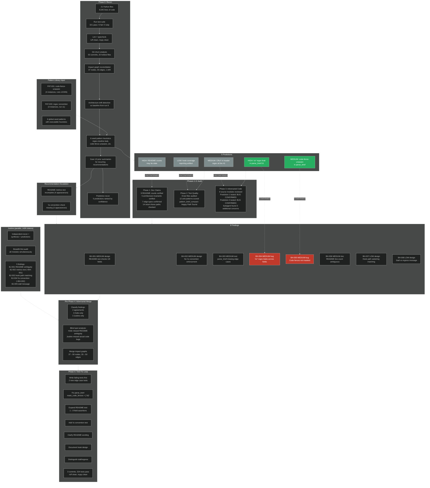

# Run 14: Audit Timeline

```mermaid
%%{init: {'theme': 'dark', 'themeVariables': {'fontSize': '12px'}}}%%
gantt
    title Holtz Run 14 — Full Audit with Adversarial Self-Play
    dateFormat HH:mm
    axisFormat %H:%M

    section Phase 0: Recon
    Archive run 13, preserve persistent artifacts       :done, p0a, 00:00, 1m
    0a Project overview (21 files, 8545 lines)          :done, p0b, after p0a, 2m
    0b Test infra (pytest, 8 test files)                :done, p0c, after p0a, 1m
    0c Test baseline (321 pass, 67% coverage)           :done, p0d, after p0c, 2m
    0d Lint (ruff clean, mypy clean)                    :done, p0e, after p0c, 1m
    0e Churn (validate_punchlist.py top at 7)           :done, p0f, after p0c, 1m
    0f Skipped tests (none)                             :done, p0g, after p0c, 1m
    Graph reconciliation (37 nodes, 1 drift)            :done, p0h, after p0g, 2m
    Architecture drift (none — stable)                  :done, p0i, after p0h, 1m
    Recommendation escalation (2 items from 13 runs)    :done, p0j, after p0i, 2m
    6 seed pattern heuristics (2 hits in brief compact) :done, p0k, after p0j, 2m
    0g Recon summary                                    :done, p0l, after p0k, 1m
    0h Predictive recon (5 predictions)                 :done, p0m, after p0l, 2m

    section Justine (parallel)
    Dispatched as background subagent                   :done, j0, after p0m, 1m
    Independent recon + audit (142K tokens)             :done, j1, after j0, 12m
    5 findings written to justine/PUNCHLIST.md          :done, j2, after j1, 1m

    section Phase 1: Doc Audit
    Extract testable claims from README                 :done, p1a, after p0m, 2m
    Verify "What's inside" (9 counts, all match)        :done, p1b, after p1a, 2m
    Verify architecture invariants (5/5 hold)           :done, p1c, after p1a, 1m
    Verify edge types, risk bounds, atomic writes       :done, p1d, after p1a, 1m
    Result: 0 new items                                 :done, p1e, after p1d, 0m

    section Phase 2: Test Audit
    Dispatch subagent for 4 large test files             :done, p2a, after p1e, 3m
    Audit pattern_brief_compact tests (predicted area)   :done, p2b, after p1e, 2m
    Finding: BH-003 test gap (Happy Path Tourist)        :crit, done, p2c, after p2b, 1m

    section Phase 3: Adversarial Audit
    Dispatch subagent for 9 source modules              :done, p3a, after p2c, 4m
    Test Prediction 1: empty field regex leak           :crit, done, p3b, after p2c, 1m
    BUG CONFIRMED: content bleed on empty fields        :crit, done, p3c, after p3b, 0m
    Test Prediction 3: code fence header matching       :crit, done, p3d, after p3c, 1m
    BUG CONFIRMED: fake header matched as real entry    :crit, done, p3e, after p3d, 0m
    Findings: BH-004 regex leak, BH-005 fence-unaware  :crit, done, p3f, after p3e, 1m

    section Pre-Phase 4: Merge
    Read Justine's 5 findings                           :done, m1, after p3f, 1m
    Classify: 2 agreements, 3+3 unique                  :done, m2, after m1, 2m
    Merge impact graphs (50 nodes, 50 edges)            :done, m3, after m2, 1m
    Archive Justine's output                            :done, m4, after m3, 1m
    Merged worklist: 8 items                            :done, m5, after m4, 0m

    section Phase 4: Fix Loop (TDD)
    Write failing tests for BH-004 + BH-005             :done, f1, after m5, 2m
    Fix parse_brief: mask fences + [ \t]* regex         :done, f2, after f1, 2m
    324 pass, commit f1b715b                            :done, f3, after f2, 1m
    Expand README metrics test (BH-001, 9 fields)       :done, f4, after f3, 2m
    Add \s convention test (BH-002)                     :done, f5, after f4, 1m
    Update README counts + wording (BH-006)             :done, f6, after f5, 1m
    324 pass, commit e5e8b5b                            :done, f7, after f6, 1m
    Document hook paths (BH-007)                        :done, f8, after f7, 1m
    Distinguish stall vs regress (BH-008)               :done, f9, after f8, 1m
    324 pass, ruff clean, mypy clean, commit cfcf762    :done, f10, after f9, 1m

    section Convergence
    All 8 items resolved                                :done, c1, after f10, 1m
    Write SUMMARY.md + update STATUS.md                 :done, c2, after c1, 1m
    Final commit 34eedec                                :done, c3, after c2, 1m
```

## What was checked, what was considered, what was found


