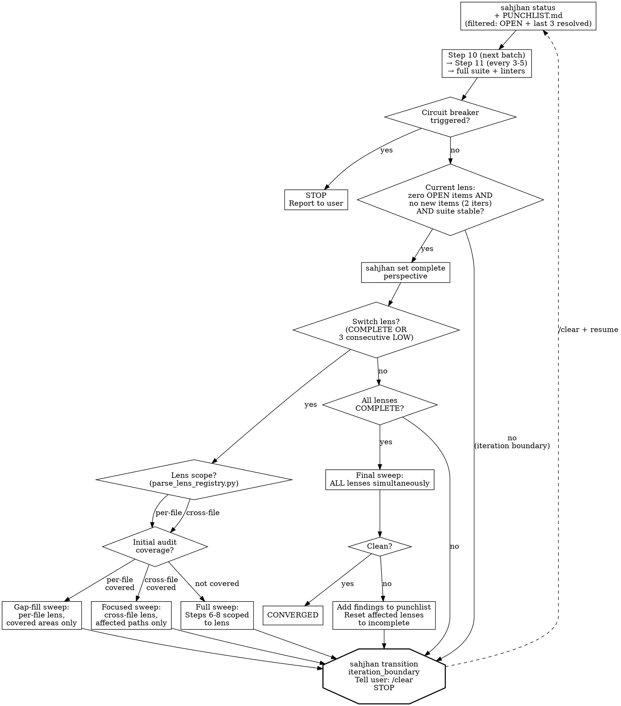

# Front-Loaded Lens Audit Implementation Plan

> **For agentic workers:** REQUIRED SUB-SKILL: Use superpowers:subagent-driven-development (recommended) or superpowers:executing-plans to implement this plan task-by-task. Steps use checkbox (`- [ ]`) syntax for tracking.

**Goal:** Make lenses self-classifying (`per-file` vs `cross-file`) and front-load lens coverage into the initial audit (Steps 7-8), so Step 14 becomes gap-fill instead of 13 full codebase re-reads.

**Architecture:** Each lens in `references/lens-registry.md` declares a `**Scope:** per-file | cross-file` field. A new `parse_lens_registry.py` script extracts this structured data. Phase-audit and phase-fix-loop docs reference scope generically — never hardcoded lens lists. Initial audit subagents receive per-file lens checklists alongside their existing work; cross-file lenses get dedicated parallel subagents during Step 8.

**Tech Stack:** Python (script), Markdown (protocol docs), TOML (events)

---

### Task 1: Add `Scope` field to lens registry

**Files:**
- Modify: `skills/holtz/references/lens-registry.md`

The registry header already explains the four-field format. We need to: (1) update the header to mention the fifth field, (2) add `**Scope:** per-file | cross-file` to each of the 13 lens definitions.

- [ ] **Step 1: Update the registry header**

The current header says "four-field format (Focus, Audit priorities, Failure modes, Entry point)". Update it to include Scope.

```markdown
Users can add custom lenses by appending new sections following the same five-field format (Focus, Scope, Audit priorities, Failure modes, Entry point). Any `## heading` in this file with the five required fields is treated as a lens.
```

Replace:
```
following the same four-field format (Focus, Audit priorities, Failure modes, Entry point)
```
With:
```
following the same five-field format (Focus, Scope, Audit priorities, Failure modes, Entry point)
```

- [ ] **Step 2: Add `Scope` to each lens**

Insert `**Scope:** per-file` or `**Scope:** cross-file` as the second field (after Focus, before Audit priorities) in each lens section. The classification is determined by whether the lens's entry point requires tracing across multiple files:

**per-file** (audit priorities evaluable from a single file):
- `component` — "Individual functions, classes, modules in isolation"
- `security` — per-file input validation, injection checks
- `contract` — "Compare documented/typed interfaces against actual implementation"
- `resource-lifecycle` — "Grep for resource acquisition calls" per file
- `idempotency` — "For each state-mutating operation" per file
- `observability` — "For each error path: is there a log entry" per file

**cross-file** (entry point requires tracing paths across files):
- `integration` — "Contracts and assumptions between modules"
- `error-propagation` — "Trace error/exception paths from throw to catch"
- `data-flow` — "Follow data from ingestion to output"
- `temporal-protocol` — "Pick a workflow that spans 2+ files"
- `concurrency` — "Identify all shared mutable state... trace all access sites"
- `semantic-fidelity` — "Trace when each value is set and cleared across ALL callers"
- `public-contract` — "Read README.md end-to-end. For each claim, grep for implementing code"

For each lens, add the line immediately after `**Focus:**`. Example for `component`:

```markdown
## component
**Focus:** Individual functions, classes, modules in isolation
**Scope:** per-file
**Audit priorities:** Correctness, edge cases, error handling, return values
```

Example for `integration`:

```markdown
## integration
**Focus:** Contracts and assumptions between modules
**Scope:** cross-file
**Audit priorities:** Interface agreements, shared state, data format assumptions, parser divergence
```

Apply this to all 13 lenses. The full set:

| Lens | Scope |
|------|-------|
| component | per-file |
| integration | cross-file |
| security | per-file |
| error-propagation | cross-file |
| data-flow | cross-file |
| contract | per-file |
| semantic-fidelity | cross-file |
| temporal-protocol | cross-file |
| public-contract | cross-file |
| concurrency | cross-file |
| resource-lifecycle | per-file |
| idempotency | per-file |
| observability | per-file |

- [ ] **Step 3: Verify the registry is well-formed**

Run: `grep -c '^\*\*Scope:\*\*' skills/holtz/references/lens-registry.md`
Expected: `13` (one per lens)

Run: `grep '^\*\*Scope:\*\*' skills/holtz/references/lens-registry.md | sort | uniq -c`
Expected: `6 **Scope:** per-file` and `7 **Scope:** cross-file`

- [ ] **Step 4: Commit**

```bash
git add skills/holtz/references/lens-registry.md
git commit -m "feat(holtz): add Scope field to lens registry for per-file/cross-file classification"
```

---

### Task 2: Write `parse_lens_registry.py` — failing tests first

**Files:**
- Create: `skills/holtz/scripts/parse_lens_registry.py`
- Create: `tests/test_parse_lens_registry.py`

The script parses the lens registry markdown and outputs structured JSON. It will be used by protocol docs (via the LLM running the script) and can be used by other scripts for validation.

- [ ] **Step 1: Write the test file**

```python
"""Tests for lens registry parser."""
import json
import sys
import textwrap
from pathlib import Path

REPO_ROOT = Path(__file__).parent.parent
sys.path.insert(0, str(REPO_ROOT / "skills" / "holtz" / "scripts"))

from parse_lens_registry import parse_lens_registry  # noqa: E402


MINIMAL_REGISTRY = textwrap.dedent("""\
    # Lens Registry

    Some header text.

    ## component
    **Focus:** Individual functions, classes, modules in isolation
    **Scope:** per-file
    **Audit priorities:** Correctness, edge cases
    **Failure modes:** Logic errors
    **Entry point:** Standard Steps 6-8

    ## integration
    **Focus:** Contracts and assumptions between modules
    **Scope:** cross-file
    **Audit priorities:** Interface agreements, shared state
    **Failure modes:** Modules that disagree
    **Entry point:** Query impact graph for edges
""")


def test_parse_returns_list():
    """Parser returns a list of lens dicts."""
    result = parse_lens_registry(MINIMAL_REGISTRY)
    assert isinstance(result, list)
    assert len(result) == 2


def test_parse_extracts_name():
    """Each lens has its heading as the name."""
    result = parse_lens_registry(MINIMAL_REGISTRY)
    names = [l["name"] for l in result]
    assert "component" in names
    assert "integration" in names


def test_parse_extracts_scope():
    """Scope field is parsed correctly."""
    result = parse_lens_registry(MINIMAL_REGISTRY)
    by_name = {l["name"]: l for l in result}
    assert by_name["component"]["scope"] == "per-file"
    assert by_name["integration"]["scope"] == "cross-file"


def test_parse_extracts_all_fields():
    """All five fields are present in parsed output."""
    result = parse_lens_registry(MINIMAL_REGISTRY)
    for lens in result:
        assert "name" in lens
        assert "focus" in lens
        assert "scope" in lens
        assert "audit_priorities" in lens
        assert "failure_modes" in lens
        assert "entry_point" in lens


def test_parse_multiline_field():
    """Fields that span multiple lines are joined."""
    registry = textwrap.dedent("""\
        ## data-flow
        **Focus:** How data transforms as it moves through the system
        **Scope:** cross-file
        **Audit priorities:** Serialization/deserialization boundaries, type coercion,
        lossy transformations, format assumptions
        **Failure modes:** Data corruption at boundaries
        **Entry point:** Follow data from ingestion to output
    """)
    result = parse_lens_registry(registry)
    assert len(result) == 1
    assert "lossy transformations" in result[0]["audit_priorities"]


def test_parse_scope_invalid_raises():
    """Invalid scope value raises ValueError."""
    import pytest
    registry = textwrap.dedent("""\
        ## bad-lens
        **Focus:** Something
        **Scope:** hybrid
        **Audit priorities:** Things
        **Failure modes:** Stuff
        **Entry point:** Somewhere
    """)
    with pytest.raises(ValueError, match="scope"):
        parse_lens_registry(registry)


def test_parse_missing_scope_raises():
    """Missing scope field raises ValueError."""
    import pytest
    registry = textwrap.dedent("""\
        ## old-lens
        **Focus:** Something
        **Audit priorities:** Things
        **Failure modes:** Stuff
        **Entry point:** Somewhere
    """)
    with pytest.raises(ValueError, match="[Ss]cope"):
        parse_lens_registry(registry)


def test_parse_live_registry():
    """Live lens-registry.md parses without errors and has 13 lenses."""
    registry_path = REPO_ROOT / "skills" / "holtz" / "references" / "lens-registry.md"
    if not registry_path.exists():
        import pytest
        pytest.skip("No live lens-registry.md")
    text = registry_path.read_text()
    result = parse_lens_registry(text)
    assert len(result) == 13
    scopes = {l["scope"] for l in result}
    assert scopes == {"per-file", "cross-file"}


def test_filter_by_scope():
    """Helper function filters lenses by scope."""
    from parse_lens_registry import filter_by_scope
    result = parse_lens_registry(MINIMAL_REGISTRY)
    per_file = filter_by_scope(result, "per-file")
    cross_file = filter_by_scope(result, "cross-file")
    assert len(per_file) == 1
    assert per_file[0]["name"] == "component"
    assert len(cross_file) == 1
    assert cross_file[0]["name"] == "integration"
```

- [ ] **Step 2: Run tests to verify they fail**

Run: `python -m pytest tests/test_parse_lens_registry.py -v`
Expected: FAIL — `ModuleNotFoundError: No module named 'parse_lens_registry'`

- [ ] **Step 3: Write `parse_lens_registry.py`**

```python
#!/usr/bin/env python3
"""Parse the lens registry markdown into structured data.

Extracts lens definitions from references/lens-registry.md, including
the Scope field that classifies lenses as per-file or cross-file.

Usage:
    python parse_lens_registry.py [path/to/lens-registry.md]
    python parse_lens_registry.py --scope per-file [path]
    python parse_lens_registry.py --scope cross-file [path]
    python parse_lens_registry.py --names-only [path]
"""
from __future__ import annotations

import argparse
import json
import re
import sys
from pathlib import Path

VALID_SCOPES = {"per-file", "cross-file"}

# Matches **Field:** value (field name is captured, value starts after the colon)
_FIELD_RE = re.compile(r"^\*\*([A-Za-z_ -]+):\*\*\s*(.*)")
_HEADING_RE = re.compile(r"^##\s+(\S+.*)$")

# Map from markdown field names to dict keys
_FIELD_MAP = {
    "Focus": "focus",
    "Scope": "scope",
    "Audit priorities": "audit_priorities",
    "Failure modes": "failure_modes",
    "Entry point": "entry_point",
}

REQUIRED_FIELDS = set(_FIELD_MAP.values())


def parse_lens_registry(text: str) -> list[dict]:
    """Parse lens registry markdown text into a list of lens dicts.

    Each lens dict has keys: name, focus, scope, audit_priorities,
    failure_modes, entry_point.

    Raises ValueError if a lens has an invalid or missing scope.
    """
    lenses: list[dict] = []
    current: dict | None = None
    current_field: str | None = None

    for line in text.split("\n"):
        heading_match = _HEADING_RE.match(line)
        if heading_match:
            if current is not None:
                _validate_and_append(current, lenses)
            current = {"name": heading_match.group(1).strip()}
            current_field = None
            continue

        if current is None:
            continue

        field_match = _FIELD_RE.match(line)
        if field_match:
            field_name = field_match.group(1).strip()
            field_value = field_match.group(2).strip()
            key = _FIELD_MAP.get(field_name)
            if key:
                current[key] = field_value
                current_field = key
            else:
                current_field = None
        elif current_field and line.strip():
            # Continuation line for a multi-line field
            current[current_field] += " " + line.strip()
        elif not line.strip():
            current_field = None

    if current is not None:
        _validate_and_append(current, lenses)

    return lenses


def _validate_and_append(lens: dict, lenses: list[dict]) -> None:
    """Validate a lens dict and append to the list if it has all required fields."""
    present = set(lens.keys()) - {"name"}
    if not present:
        return  # Header-only section (like the intro paragraph)

    # Only validate lenses that have at least some fields
    if present & REQUIRED_FIELDS:
        if "scope" not in lens:
            raise ValueError(
                f"Lens '{lens.get('name', '?')}' is missing required Scope field"
            )
        if lens["scope"] not in VALID_SCOPES:
            raise ValueError(
                f"Lens '{lens.get('name', '?')}' has invalid scope '{lens['scope']}'. "
                f"Must be one of: {', '.join(sorted(VALID_SCOPES))}"
            )
        lenses.append(lens)


def filter_by_scope(lenses: list[dict], scope: str) -> list[dict]:
    """Filter a list of parsed lenses by scope value."""
    return [l for l in lenses if l["scope"] == scope]


def main() -> None:
    parser = argparse.ArgumentParser(description="Parse lens registry")
    parser.add_argument(
        "path",
        nargs="?",
        help="Path to lens-registry.md (default: auto-detect)",
    )
    parser.add_argument(
        "--scope",
        choices=sorted(VALID_SCOPES),
        help="Filter to lenses with this scope",
    )
    parser.add_argument(
        "--names-only",
        action="store_true",
        help="Output only lens names, one per line",
    )
    args = parser.parse_args()

    if args.path:
        path = Path(args.path)
    else:
        # Auto-detect: look relative to this script's location
        script_dir = Path(__file__).parent
        path = script_dir.parent / "references" / "lens-registry.md"
        if not path.exists():
            print(f"Cannot find lens-registry.md at {path}", file=sys.stderr)
            sys.exit(1)

    text = path.read_text(encoding="utf-8")
    lenses = parse_lens_registry(text)

    if args.scope:
        lenses = filter_by_scope(lenses, args.scope)

    if args.names_only:
        for lens in lenses:
            print(lens["name"])
    else:
        print(json.dumps(lenses, indent=2))


if __name__ == "__main__":
    main()
```

- [ ] **Step 4: Run tests to verify they pass**

Run: `python -m pytest tests/test_parse_lens_registry.py -v`
Expected: All 10 tests PASS

- [ ] **Step 5: Run linters**

Run: `ruff check skills/holtz/scripts/parse_lens_registry.py tests/test_parse_lens_registry.py`
Expected: No errors

Run: `mypy --explicit-package-bases skills/holtz/scripts/parse_lens_registry.py`
Expected: No errors

- [ ] **Step 6: Commit**

```bash
git add skills/holtz/scripts/parse_lens_registry.py tests/test_parse_lens_registry.py
git commit -m "feat(holtz): add parse_lens_registry.py script for programmatic lens classification"
```

---

### Task 3: Add `lens_coverage_recorded` event to events.toml

**Files:**
- Modify: `enforcement/events.toml`

- [ ] **Step 1: Add the new event type**

Append after the `[events.lens_sweep_started]` block:

```toml
[events.lens_coverage_recorded]
description = "Initial audit lens coverage matrix recorded after Steps 7-8"
fields = [
    { name = "project", type = "string" },
    { name = "run", type = "string", pattern = "^\\d+$" },
    { name = "auditor", type = "string", pattern = "^(holtz|justine)$" },
    { name = "per_file_lenses_covered", type = "string", pattern = "^\\d+$" },
    { name = "cross_file_lenses_covered", type = "string", pattern = "^\\d+$" },
    { name = "artifact_path", type = "string" },
]
```

- [ ] **Step 2: Add optional `sweep_type` field to `lens_sweep_started`**

The existing `lens_sweep_started` event needs a `sweep_type` field so the protocol can distinguish full sweeps from gap-fills. Add it as an optional field:

Current:
```toml
[events.lens_sweep_started]
description = "A lens sweep has been initiated for a specific perspective"
fields = [
    { name = "perspective", type = "string" },
    { name = "project", type = "string" },
    { name = "run", type = "string", pattern = "^\\d+$" },
    { name = "auditor", type = "string", pattern = "^(holtz|justine)$" },
]
```

New:
```toml
[events.lens_sweep_started]
description = "A lens sweep has been initiated for a specific perspective"
fields = [
    { name = "perspective", type = "string" },
    { name = "sweep_type", type = "string", pattern = "^(full|gap-fill|cross-file-focused|initial-audit)$", optional = true },
    { name = "project", type = "string" },
    { name = "run", type = "string", pattern = "^\\d+$" },
    { name = "auditor", type = "string", pattern = "^(holtz|justine)$" },
]
```

- [ ] **Step 3: Run existing enforcement config tests**

Run: `python -m pytest tests/test_enforcement_config.py -v`
Expected: PASS (these tests validate TOML structure)

- [ ] **Step 4: Commit**

```bash
git add enforcement/events.toml
git commit -m "feat(holtz): add lens_coverage_recorded event and sweep_type field for front-loaded audit"
```

---

### Task 4: Update phase-audit.md — multi-lens subagent briefs

**Files:**
- Modify: `skills/holtz/references/phase-audit.md`

This is the core protocol change. Steps 7-8 subagents receive per-file lens assignments. Cross-file lens subagents are dispatched in parallel during Step 8. A lens coverage matrix is written after both steps complete.

- [ ] **Step 1: Add lens assignment preamble before Step 7**

Insert the following between the Step 6 section and the Step 7 heading:

```markdown
### Lens Assignment for Steps 7-8

Before dispatching Step 7-8 subagents, determine which lenses each subagent should apply alongside its primary work:

1. Run: `python ${CLAUDE_PLUGIN_ROOT}/skills/holtz/scripts/parse_lens_registry.py --scope per-file --names-only`
2. These per-file lenses will be included in every Step 7-8 subagent brief as a secondary checklist. They are evaluable from a single file read — the subagent checks them as a byproduct of its existing work.
3. Run: `python ${CLAUDE_PLUGIN_ROOT}/skills/holtz/scripts/parse_lens_registry.py --scope cross-file`
4. Cross-file lenses require tracing paths across modules. These get dedicated parallel subagents dispatched at the end of Step 8, using impact graph entry points.
```

- [ ] **Step 2: Update Step 7 subagent brief**

In the Step 7 section, replace the current subagent brief instruction (item 3) to include per-file lens assignments. The current brief says:

```
3. **Subagent brief:** Instruct each subagent to: (a) read the compact pattern brief...
```

Replace with:

```markdown
3. **Subagent brief:** Instruct each subagent to: (a) read the compact pattern brief by running `python ${CLAUDE_PLUGIN_ROOT}/skills/holtz/scripts/pattern_brief_compact.py docs/holtz/patterns-brief.md` — if a finding matches a pattern ID, reference it in the punchlist item; if a pattern match seems likely but uncertain, read the full entry from `docs/holtz/patterns-brief.md` for that specific pattern ID, (b) check known patterns against the code being reviewed, (c) **apply per-file lens checklist** — for each test file, also check concerns from all `per-file` scoped lenses (run `python ${CLAUDE_PLUGIN_ROOT}/skills/holtz/scripts/parse_lens_registry.py --scope per-file` for the checklist; focus on each lens's audit priorities as they apply to the file), (d) tag all findings with `**Lens:**` field identifying which lens discovered them, (e) write findings to disk before returning, (f) report exactly one status: DONE / DONE_WITH_CONCERNS / BLOCKED / NEEDS_CONTEXT, (g) choose the most conservative default for ambiguities — report NEEDS_CONTEXT only if genuinely impossible without human input. **When reviewing subagent output:** verify findings by reading actual code. Subagents may have missed context or misidentified patterns. Confirm each finding before it enters the punchlist.
```

- [ ] **Step 3: Update Step 8 subagent brief and add cross-file dispatch**

In the Step 8 section, apply the same per-file lens expansion to the subagent brief (item 2). Replace item 2's subagent brief with the same pattern as Step 7 — add `(c) **apply per-file lens checklist**` and `(d) tag all findings with **Lens:** field`.

Then, after item 5 (Add semantic edges) and before item 6 (Run `sahjhan transition audit_complete`), insert:

```markdown
5b. **Dispatch cross-file lens subagents.** After source module subagents return, dispatch parallel subagents for cross-file lenses. Run `python ${CLAUDE_PLUGIN_ROOT}/skills/holtz/scripts/parse_lens_registry.py --scope cross-file` to get the list. Group cross-file lenses into 2-3 subagent batches (e.g., batch by relatedness: {integration, contract-adjacent} / {error-propagation, data-flow} / {temporal-protocol, concurrency, semantic-fidelity} / {public-contract}). Each subagent receives:
   - Its assigned lenses with their entry points from the registry
   - The impact graph (`docs/holtz/impact-graph.json`) for edge queries
   - The recon summary for project context
   - Instructions to write findings to `docs/holtz/audit/lens-{name}.md` for each lens covered
   - The same pattern brief and finding format as other subagents

   **Model routing:** Use `model: "sonnet"` for cross-file lens subagents. Path tracing against entry points is structured work.

   Record: `sahjhan event lens_sweep_started --field perspective={lens} --field sweep_type=initial-audit` for each cross-file lens before dispatching.

5c. **Write lens coverage matrix.** After all Step 7-8 subagents (including cross-file) complete, write `docs/holtz/audit/lens-coverage.md`:

   ```markdown
   # Lens Coverage — Initial Audit

   Generated after Steps 7-8. Per-file lenses were checked by every subagent alongside primary work. Cross-file lenses received dedicated subagent sweeps.

   ## Per-File Lenses
   | Lens | Files Covered | Findings | Status |
   |------|--------------|----------|--------|
   | component | all (Steps 7-8) | N | covered |
   | security | all (Steps 7-8) | N | covered |
   | ... | ... | ... | ... |

   ## Cross-File Lenses
   | Lens | Entry Points Traced | Findings | Status |
   |------|-------------------|----------|--------|
   | integration | N edges | N | covered / partial / not-covered |
   | ... | ... | ... | ... |
   ```

   Record: `sahjhan event lens_coverage_recorded --field per_file_lenses_covered=N --field cross_file_lenses_covered=N --field artifact_path=docs/holtz/audit/lens-coverage.md`
```

- [ ] **Step 4: Verify the file is well-formed**

Read through the modified `phase-audit.md` to verify all markdown formatting is correct, no dangling references, and step numbering is consistent.

- [ ] **Step 5: Commit**

```bash
git add skills/holtz/references/phase-audit.md
git commit -m "feat(holtz): front-load per-file and cross-file lenses into initial audit (Steps 7-8)"
```

---

### Task 5: Update phase-fix-loop.md — Step 14 gap-fill revision

**Files:**
- Modify: `skills/holtz/references/phase-fix-loop.md`

Step 14 currently says "Re-run Steps 6-8 scoped to the current analytical lens." It needs to become scope-aware: per-file lenses get a gap-fill sweep; cross-file lenses get a focused sweep. Both are lighter than a full re-audit.

- [ ] **Step 1: Replace Step 14 content**

Replace the current Step 14 section (from `### Step 14: Lens Rotation` through the end of the `digraph` block) with:

```markdown
### Step 14: Lens Rotation

Read [references/lens-registry.md](references/lens-registry.md) for the full set of analytical lenses. The convergence loop rotates through lenses. True convergence requires ALL lenses clean in the same final sweep.

**Determine sweep strategy per lens.** Run `python ${CLAUDE_PLUGIN_ROOT}/skills/holtz/scripts/parse_lens_registry.py` and read `docs/holtz/audit/lens-coverage.md` (written after Steps 7-8). The sweep strategy depends on lens scope and initial audit coverage:

| Scope | Initial Coverage | Sweep Strategy |
|-------|-----------------|----------------|
| per-file | covered | **Gap-fill:** Audit only files not covered in initial audit (new files, files changed by fixes, files missed by subagent batching). Record `sweep_type=gap-fill`. |
| per-file | not covered | **Full:** Standard Steps 6-8 scoped to this lens. Record `sweep_type=full`. |
| cross-file | covered | **Focused:** Re-trace entry points from lens registry using updated impact graph. Focus on paths affected by fixes since initial audit. Record `sweep_type=cross-file-focused`. |
| cross-file | not covered | **Full:** Standard Steps 6-8 scoped to this lens entry point. Record `sweep_type=full`. |

For each lens sweep, record: `sahjhan event lens_sweep_started --field perspective={lens} --field sweep_type={type}`

**Gap-fill sweep procedure (per-file lenses with initial coverage):**
1. Read `docs/holtz/audit/lens-coverage.md` for which files were covered
2. Identify gaps: files created/modified since initial audit (`git diff --name-only` from audit commit), plus any files not in subagent batches
3. Dispatch a subagent with the gap files and the lens's audit priorities
4. Write findings to `docs/holtz/audit/lens-{name}.md`

**Focused sweep procedure (cross-file lenses with initial coverage):**
1. Read the lens's initial audit output at `docs/holtz/audit/lens-{name}.md`
2. Query impact graph for edges relevant to this lens's entry point
3. Focus on paths that include nodes modified by fixes since the initial audit
4. Dispatch a subagent with the focused path list and lens audit priorities
5. Write findings to `docs/holtz/audit/lens-{name}.md` (append or replace)

After completing a lens sweep (any type), return to Step 10 (fix loop) for any new findings. When a perspective passes clean, run `sahjhan set complete perspective`. Then `sahjhan transition lens_rotate` to switch to the next perspective.

**Circuit Breakers:**
- **MAX_ITERATIONS:** 15 total fix-loop iterations. Enforced by Sahjhan's `fix_commit` gate (`max_count = 15`). After 15, the gate blocks — report remaining items to the user.
- **SAME_ITEM:** 3 attempts on the same punchlist item. After 3, escalate to the user.
- **NO_PROGRESS:** 3 consecutive iterations with no items resolved. Stop and report.
- **CONTEXT_BUDGET:** If context utilization exceeds 60%, wrap up the current item and proceed to the convergence boundary — run `sahjhan transition iteration_boundary` and instruct `/clear`. Do not wait for compaction.
```

- [ ] **Step 2: Update the convergence loop digraph**

Replace the existing digraph in Step 14 with one that reflects the scope-aware sweep strategy:



- [ ] **Step 3: Commit**

```bash
git add skills/holtz/references/phase-fix-loop.md
git commit -m "feat(holtz): revise Step 14 lens rotation to use scope-aware gap-fill/focused sweeps"
```

---

### Task 6: Run full test suite and linters

**Files:** None (verification only)

- [ ] **Step 1: Run pytest**

Run: `python -m pytest -v`
Expected: All tests PASS (including new `test_parse_lens_registry.py` and existing `test_live_quiz_bank_valid`)

- [ ] **Step 2: Run ruff**

Run: `ruff check .`
Expected: No errors

- [ ] **Step 3: Run mypy**

Run: `mypy --explicit-package-bases skills/holtz/scripts/ hooks/ enforcement/hooks/`
Expected: No errors

---

### Task 7: Update Justine's skill to reference the scope field

**Files:**
- Modify: `skills/holtz/references/justine-skill.md`

Justine already does simultaneous multi-lens auditing. The update is minor — reference the scope field so future lens additions are automatically handled rather than relying on Justine's hardcoded lens order.

- [ ] **Step 1: Update J2 to reference scope**

In the J2 section, after the line about "ALL lenses simultaneously", add a note:

Find:
```
2. Audit across **ALL lenses simultaneously** rather than one lens at a time. For each code area, consider all six lens perspectives in a single read-through rather than reading the same code six times under six lenses.
```

Replace with:
```
2. Audit across **ALL lenses simultaneously** rather than one lens at a time. Run `python ${CLAUDE_PLUGIN_ROOT}/skills/holtz/scripts/parse_lens_registry.py` to get the current lens set with scopes. For each code area, apply all `per-file` scoped lenses in a single read-through. For `cross-file` scoped lenses, trace paths using impact graph entry points — these may require reading additional files beyond the current area.
```

- [ ] **Step 2: Commit**

```bash
git add skills/holtz/references/justine-skill.md
git commit -m "feat(holtz): update Justine J2 to reference lens scope field from registry"
```

---

### Summary of changes

| File | Change |
|------|--------|
| `skills/holtz/references/lens-registry.md` | Add `**Scope:** per-file\|cross-file` to all 13 lenses |
| `skills/holtz/scripts/parse_lens_registry.py` | New script: parses registry markdown → JSON |
| `tests/test_parse_lens_registry.py` | New tests for the parser |
| `enforcement/events.toml` | Add `lens_coverage_recorded` event, `sweep_type` field on `lens_sweep_started` |
| `skills/holtz/references/phase-audit.md` | Multi-lens subagent briefs (Steps 7-8), cross-file dispatch, lens coverage matrix |
| `skills/holtz/references/phase-fix-loop.md` | Step 14 gap-fill/focused sweep strategy (replaces full re-audit per lens) |
| `skills/holtz/references/justine-skill.md` | Reference scope field in J2 |
