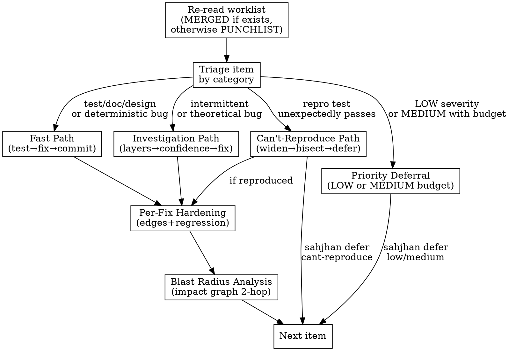

# Deferred Finding Protocol — Implementation Plan

> **For agentic workers:** REQUIRED SUB-SKILL: Use superpowers:subagent-driven-development (recommended) or superpowers:executing-plans to implement this plan task-by-task. Steps use checkbox (`- [ ]`) syntax for tracking.

**Goal:** Add enforcement-level support for deferring punchlist findings via Sahjhan, with severity-based rules and evidence gates.

**Architecture:** Three self-loop transitions (`defer_cant_reproduce`, `defer_low`, `defer_medium`) in the fix loop, each with appropriate gates. A new `finding_deferred` event records deferrals. Convergence gates updated to treat deferred findings like resolved ones. Templates updated to render DEFERRED status.

**Tech Stack:** TOML (Sahjhan config), Tera (templates), Python (evidence script + tests)

**Spec:** `docs/superpowers/specs/2026-04-07-deferred-finding-protocol-design.md`

---

### Task 1: Evidence Validation Script

**Files:**
- Create: `enforcement/scripts/check_repro_evidence.py`
- Create: `tests/test_repro_evidence.py`

- [ ] **Step 1: Write the failing tests**

```python
"""Tests for check_repro_evidence.py."""
from __future__ import annotations

import pytest

from enforcement.scripts.check_repro_evidence import check_repro_evidence


def test_investigation_file_exists(tmp_path):
    """Investigation file present — evidence sufficient."""
    inv = tmp_path / "investigations" / "BH-042.md"
    inv.parent.mkdir(parents=True)
    inv.write_text("## Reproduction Attempts\n\n- Ran test 100x, 0 failures\n")
    assert check_repro_evidence("BH-042", str(tmp_path)) is True


def test_no_investigation_file_fails(tmp_path):
    """No investigation file and no evidence — fails."""
    assert check_repro_evidence("BH-042", str(tmp_path)) is False


def test_empty_investigation_file_fails(tmp_path):
    """Empty investigation file is not evidence."""
    inv = tmp_path / "investigations" / "BH-042.md"
    inv.parent.mkdir(parents=True)
    inv.write_text("")
    assert check_repro_evidence("BH-042", str(tmp_path)) is False


def test_invalid_finding_id_raises():
    """Invalid finding ID format raises ValueError."""
    with pytest.raises(ValueError, match="Invalid finding ID"):
        check_repro_evidence("BOGUS", "/tmp")
```

- [ ] **Step 2: Run tests to verify they fail**

Run: `python -m pytest tests/test_repro_evidence.py -v`
Expected: FAIL — `ModuleNotFoundError` or `ImportError` because `check_repro_evidence` doesn't exist yet.

- [ ] **Step 3: Write the implementation**

```python
#!/usr/bin/env python3
"""Check that a can't-reproduce deferral has sufficient evidence.

Verifies that an investigation file exists at
docs/holtz/investigations/{item_id}.md and is non-empty.

Usage: python check_repro_evidence.py <finding_id> [--holtz-dir PATH]
Exit 0 if evidence found, exit 1 otherwise.
"""
from __future__ import annotations

import os
import re
import sys

FINDING_ID_RE = re.compile(r"^B[HJ]-\d{3}$")


def check_repro_evidence(finding_id: str, holtz_dir: str) -> bool:
    """Return True if reproduction evidence exists for the finding.

    Args:
        finding_id: The punchlist item ID (e.g., BH-042).
        holtz_dir: Path to the docs/holtz directory.
    """
    if not FINDING_ID_RE.match(finding_id):
        raise ValueError(
            f"Invalid finding ID '{finding_id}'. Expected format: BH-NNN or BJ-NNN"
        )

    investigation_path = os.path.join(
        holtz_dir, "investigations", f"{finding_id}.md"
    )

    if not os.path.isfile(investigation_path):
        return False

    # File must be non-empty
    return os.path.getsize(investigation_path) > 0


def main() -> None:
    if len(sys.argv) < 2:
        print(
            "Usage: check_repro_evidence.py <finding_id> [--holtz-dir PATH]",
            file=sys.stderr,
        )
        sys.exit(1)

    finding_id = sys.argv[1]
    holtz_dir = "docs/holtz"
    if "--holtz-dir" in sys.argv:
        idx = sys.argv.index("--holtz-dir")
        if idx + 1 < len(sys.argv):
            holtz_dir = sys.argv[idx + 1]

    try:
        if check_repro_evidence(finding_id, holtz_dir):
            print(f"PASS: Evidence found for {finding_id}")
            sys.exit(0)
        else:
            print(
                f"FAIL: No evidence for {finding_id}. "
                f"Expected investigation file at {holtz_dir}/investigations/{finding_id}.md",
                file=sys.stderr,
            )
            sys.exit(1)
    except ValueError as e:
        print(f"FAIL: {e}", file=sys.stderr)
        sys.exit(1)


if __name__ == "__main__":
    main()
```

- [ ] **Step 4: Run tests to verify they pass**

Run: `python -m pytest tests/test_repro_evidence.py -v`
Expected: All 4 tests PASS.

- [ ] **Step 5: Run linters**

Run: `ruff check enforcement/scripts/check_repro_evidence.py tests/test_repro_evidence.py`
Expected: No violations.

- [ ] **Step 6: Commit**

```bash
git add enforcement/scripts/check_repro_evidence.py tests/test_repro_evidence.py
git commit -m "feat(enforcement): add reproduction evidence validation script

Gate script for can't-reproduce deferrals. Checks that an investigation
file exists at docs/holtz/investigations/{finding_id}.md and is non-empty.

Ref: BH-042"
```

---

### Task 2: Event Definition

**Files:**
- Modify: `enforcement/events.toml` (append after line 515)

- [ ] **Step 1: Add the `finding_deferred` event definition**

Append to `enforcement/events.toml` after the `_checkpoint` event:

```toml
[events.finding_deferred]
description = "A finding was deferred"
fields = [
    { name = "project", type = "string" },
    { name = "run", type = "string", pattern = "^\\d+$" },
    { name = "auditor", type = "string", pattern = "^(holtz|justine)$" },
    { name = "phase", type = "string", pattern = "^(recon|audit|merge|fix_loop|convergence|finalize)$" },
    { name = "step", type = "string", pattern = "^\\d+$" },
    { name = "id", type = "string", pattern = "^B[HJ]-\\d{3}$" },
    { name = "reason", type = "string", pattern = "^(cant_reproduce|low_priority|medium_budget)$" },
    { name = "evidence_path", type = "string", optional = true },
]
```

- [ ] **Step 2: Verify TOML syntax**

Run: `python -c "import tomllib; tomllib.load(open('enforcement/events.toml', 'rb')); print('OK')"`
Expected: `OK`

- [ ] **Step 3: Commit**

```bash
git add enforcement/events.toml
git commit -m "feat(enforcement): add finding_deferred event definition

Three deferral reasons: cant_reproduce (any severity, requires evidence),
low_priority (LOW only), medium_budget (MEDIUM only, 50% cap)."
```

---

### Task 3: Deferral Transitions

**Files:**
- Modify: `enforcement/transitions.toml` (insert after the `fix_commit` self-loop block, around line 75)

- [ ] **Step 1: Add three deferral self-loop transitions**

Insert after the `fix_commit` transition block (after line 75) and before the context reset section:

```toml
# ── Deferral: can't reproduce ──

[[transitions]]
from = "fix_loop"
to = "fix_loop"
command = "defer_cant_reproduce"
args = ["item_id"]
gates = [
    { type = "query", sql = "SELECT count(*) >= 1 FROM events WHERE type='finding' AND id='{{item_id}}'", expect = "true", intent = "finding must exist" },
    { type = "query", sql = "SELECT count(*) = 0 FROM events WHERE type IN ('finding_resolved', 'finding_deferred') AND id='{{item_id}}'", expect = "true", intent = "finding must not already be resolved or deferred" },
    { type = "ledger_has_event_since", event = "fix_start", since = "last_transition", intent = "must have started working on this item" },
    { type = "command_succeeds", cmd = "python enforcement/scripts/check_repro_evidence.py {{item_id}}", intent = "reproduction attempts must be documented in investigation file" },
]

# ── Deferral: LOW severity ──

[[transitions]]
from = "fix_loop"
to = "fix_loop"
command = "defer_low"
args = ["item_id"]
gates = [
    { type = "query", sql = "SELECT count(*) >= 1 FROM events WHERE type='finding' AND id='{{item_id}}' AND severity='LOW'", expect = "true", intent = "finding must exist and be LOW severity" },
    { type = "query", sql = "SELECT count(*) = 0 FROM events WHERE type IN ('finding_resolved', 'finding_deferred') AND id='{{item_id}}'", expect = "true", intent = "finding must not already be resolved or deferred" },
]

# ── Deferral: MEDIUM severity (budget-capped) ──

[[transitions]]
from = "fix_loop"
to = "fix_loop"
command = "defer_medium"
args = ["item_id"]
gates = [
    { type = "query", sql = "SELECT count(*) >= 1 FROM events WHERE type='finding' AND id='{{item_id}}' AND severity='MEDIUM'", expect = "true", intent = "finding must exist and be MEDIUM severity" },
    { type = "query", sql = "SELECT count(*) = 0 FROM events WHERE type IN ('finding_resolved', 'finding_deferred') AND id='{{item_id}}'", expect = "true", intent = "finding must not already be resolved or deferred" },
    { type = "query", sql = "SELECT (SELECT count(*) FROM events WHERE type='finding_deferred' AND reason='medium_budget') < (SELECT count(*) FROM events WHERE type='finding' AND severity='MEDIUM') / 2", expect = "true", intent = "MEDIUM deferrals must not exceed 50% of total MEDIUM findings" },
]
```

- [ ] **Step 2: Verify TOML syntax**

Run: `python -c "import tomllib; tomllib.load(open('enforcement/transitions.toml', 'rb')); print('OK')"`
Expected: `OK`

- [ ] **Step 3: Commit**

```bash
git add enforcement/transitions.toml
git commit -m "feat(enforcement): add deferral self-loop transitions

Three fix_loop self-loops: defer_cant_reproduce (any severity, requires
evidence + fix_start), defer_low (LOW only), defer_medium (MEDIUM only,
50% budget cap enforced at deferral time)."
```

---

### Task 4: Convergence Gate Updates

**Files:**
- Modify: `enforcement/transitions.toml` (lines 124 and 168)

- [ ] **Step 1: Update the perspective completion gate (line 124)**

Change the query in the `set complete perspective` transition from:

```sql
SELECT count(*) FROM events f WHERE f.type='finding' AND f.id NOT IN (SELECT r.id FROM events r WHERE r.type='finding_resolved')
```

To:

```sql
SELECT count(*) FROM events f WHERE f.type='finding' AND f.id NOT IN (SELECT r.id FROM events r WHERE r.type='finding_resolved') AND f.id NOT IN (SELECT d.id FROM events d WHERE d.type='finding_deferred')
```

Update the intent to: `"all findings must be resolved or deferred"`

- [ ] **Step 2: Update the final sweep convergence gate (line 168)**

Same change to the query in the `converge` transition. Same intent update.

- [ ] **Step 3: Verify TOML syntax**

Run: `python -c "import tomllib; tomllib.load(open('enforcement/transitions.toml', 'rb')); print('OK')"`
Expected: `OK`

- [ ] **Step 4: Commit**

```bash
git add enforcement/transitions.toml
git commit -m "fix(enforcement): convergence gates accept deferred findings

Both perspective completion and final sweep convergence gates now exclude
deferred findings alongside resolved ones."
```

---

### Task 5: Aliases

**Files:**
- Modify: `enforcement/protocol.toml` (in the `[aliases]` section, around line 60)

- [ ] **Step 1: Add deferral aliases**

Add the following lines to the `[aliases]` section in `enforcement/protocol.toml`:

```toml
"defer cant-reproduce" = "transition defer_cant_reproduce"
"defer low" = "transition defer_low"
"defer medium" = "transition defer_medium"
```

- [ ] **Step 2: Verify TOML syntax**

Run: `python -c "import tomllib; tomllib.load(open('enforcement/protocol.toml', 'rb')); print('OK')"`
Expected: `OK`

- [ ] **Step 3: Commit**

```bash
git add enforcement/protocol.toml
git commit -m "feat(enforcement): add defer aliases for sahjhan CLI

sahjhan defer cant-reproduce BH-NNN, defer low BH-NNN, defer medium BH-NNN."
```

---

### Task 6: Punchlist Template

**Files:**
- Modify: `enforcement/templates/punchlist.md.tera` (lines 11 and 22)

- [ ] **Step 1: Add deferred ID set**

After the `resolved_ids` line (line 11), add:

```tera

```

- [ ] **Step 2: Update the status column**

Replace the status cell on line 22:

```tera
| RESOLVEDOPEN |
```

With:

```tera
| RESOLVEDDEFERREDOPEN |
```

- [ ] **Step 3: Commit**

```bash
git add enforcement/templates/punchlist.md.tera
git commit -m "feat(enforcement): render DEFERRED status in punchlist template"
```

---

### Task 7: Status Template

**Files:**
- Modify: `enforcement/templates/status.md.tera` (lines 23-24)

- [ ] **Step 1: Add deferred count and update findings line**

After the `resolved_count` line (line 23), add:

```tera

```

Replace line 24:

```tera
**Open:** {{ finding_count - resolved_count }} | **Resolved:** {{ resolved_count }} | **Total:** {{ finding_count }}
```

With:

```tera
**Open:** {{ finding_count - resolved_count - deferred_count }} | **Resolved:** {{ resolved_count }} | **Deferred:** {{ deferred_count }} | **Total:** {{ finding_count }}
```

- [ ] **Step 2: Commit**

```bash
git add enforcement/templates/status.md.tera
git commit -m "feat(enforcement): add deferred count to status template"
```

---

### Task 8: Summary Template

**Files:**
- Modify: `enforcement/templates/summary.md.tera` (lines 15-26, 34-44)

- [ ] **Step 1: Add deferred set to the results section**

After line 15 (`resolutions` set), add:

```tera


```

- [ ] **Step 2: Update the Results table**

Replace line 26:

```tera
| Open at convergence | {{ finding_count - resolved_count }} |
```

With:

```tera
| Resolved | {{ resolved_count }} |
| Deferred | {{ deferred_count }} |
| Open at convergence | {{ finding_count - resolved_count - deferred_count }} |
```

And remove the existing `| Resolved | {{ resolved_count }} |` line (line 25) since it's now in the block above.

- [ ] **Step 3: Add deferred column to severity breakdown**

After building `resolved_ids` (line 34), add:

```tera

```

Replace the severity table header (line 35):

```tera
| Severity | Found | Resolved |
```

With:

```tera
| Severity | Found | Resolved | Deferred |
```

In the severity loop body (lines 39-44), after the `sev_resolved` counter, add a `sev_deferred` counter:

```tera




```

Update the row output from:

```tera
| {{ severity }} | {{ sev_findings | length }} | {{ sev_resolved }} |
```

To:

```tera
| {{ severity }} | {{ sev_findings | length }} | {{ sev_resolved }} | {{ sev_deferred }} |
```

- [ ] **Step 4: Add deferred column to perspective breakdown**

Same pattern as severity. Replace the perspective table header (line 51):

```tera
| Perspective | Found | Resolved |
```

With:

```tera
| Perspective | Found | Resolved | Deferred |
```

In the perspective loop body (lines 55-57), add after `persp_resolved`:

```tera




```

Update the row output from:

```tera
| {{ m.name }} | {{ persp_findings | length }} | {{ persp_resolved }} |
```

To:

```tera
| {{ m.name }} | {{ persp_findings | length }} | {{ persp_resolved }} | {{ persp_deferred }} |
```

- [ ] **Step 5: Commit**

```bash
git add enforcement/templates/summary.md.tera
git commit -m "feat(enforcement): add deferred counts to summary template

Results table, severity breakdown, and perspective breakdown all track
deferred findings alongside resolved."
```

---

### Task 9: Render Trigger

**Files:**
- Modify: `enforcement/renders.toml` (line 11)

- [ ] **Step 1: Add `finding_deferred` to the punchlist render trigger**

Replace line 11:

```toml
event_types = ["finding", "finding_resolved"]
```

With:

```toml
event_types = ["finding", "finding_resolved", "finding_deferred"]
```

- [ ] **Step 2: Verify TOML syntax**

Run: `python -c "import tomllib; tomllib.load(open('enforcement/renders.toml', 'rb')); print('OK')"`
Expected: `OK`

- [ ] **Step 3: Commit**

```bash
git add enforcement/renders.toml
git commit -m "feat(enforcement): trigger punchlist re-render on finding_deferred"
```

---

### Task 10: Step-10 Procedure Updates

**Files:**
- Modify: `skills/holtz/references/step-10-fix-loop.md`

- [ ] **Step 1: Update the triage flowchart**

Replace the existing flowchart (lines 7-30) with:



- [ ] **Step 2: Update the can't-reproduce path (line 89)**

Replace:

```markdown
If not reproducible after structured attempts: mark the item DEFERRED with evidence. Do not silently drop it.
```

With:

```markdown
If not reproducible after structured attempts:

1. Ensure reproduction attempts are documented in `docs/holtz/investigations/{item_id}.md`
2. Run: `sahjhan defer cant-reproduce {item_id}`
3. Run: `sahjhan event finding_deferred --field id={item_id} --field reason=cant_reproduce --field evidence_path=docs/holtz/investigations/{item_id}.md`
4. Update PUNCHLIST.md status to DEFERRED

Do not silently drop the item.
```

- [ ] **Step 3: Add Priority Deferral section**

After the Can't-Reproduce Path section, add a new section:

```markdown
## Priority Deferral

For LOW and MEDIUM findings where the fix is legitimate but lower priority than the current audit scope. This is not a shortcut — attempt triage before deferring.

**LOW severity:** All LOW findings may be deferred.

```
sahjhan defer low {item_id}
sahjhan event finding_deferred --field id={item_id} --field reason=low_priority
```

**MEDIUM severity:** Up to half of MEDIUM findings may be deferred. The budget is enforced at deferral time — if the cap is reached, the transition is blocked.

```
sahjhan defer medium {item_id}
sahjhan event finding_deferred --field id={item_id} --field reason=medium_budget
```

HIGH and CRITICAL findings are never deferrable via priority (only via can't-reproduce with evidence).
```

- [ ] **Step 4: Commit**

```bash
git add skills/holtz/references/step-10-fix-loop.md
git commit -m "feat(holtz): add deferral procedures to step-10 fix loop

Triage flowchart updated with priority deferral path. Can't-reproduce
path now references sahjhan commands. New Priority Deferral section
documents LOW/MEDIUM deferral rules and budget cap."
```

---

### Task 11: Full Test Suite Verification

- [ ] **Step 1: Run the full test suite**

Run: `python -m pytest --tb=short -q`
Expected: All tests pass, no regressions.

- [ ] **Step 2: Run linters**

Run: `ruff check .`
Expected: No violations.

- [ ] **Step 3: Run type checker**

Run: `mypy --explicit-package-bases skills/holtz/scripts/ hooks/ enforcement/hooks/`
Expected: No errors.

- [ ] **Step 4: Verify all TOML files parse**

Run: `python -c "import tomllib, pathlib; [tomllib.load(open(f, 'rb')) for f in pathlib.Path('enforcement').glob('*.toml')]; print('All TOML files OK')"`
Expected: `All TOML files OK`
