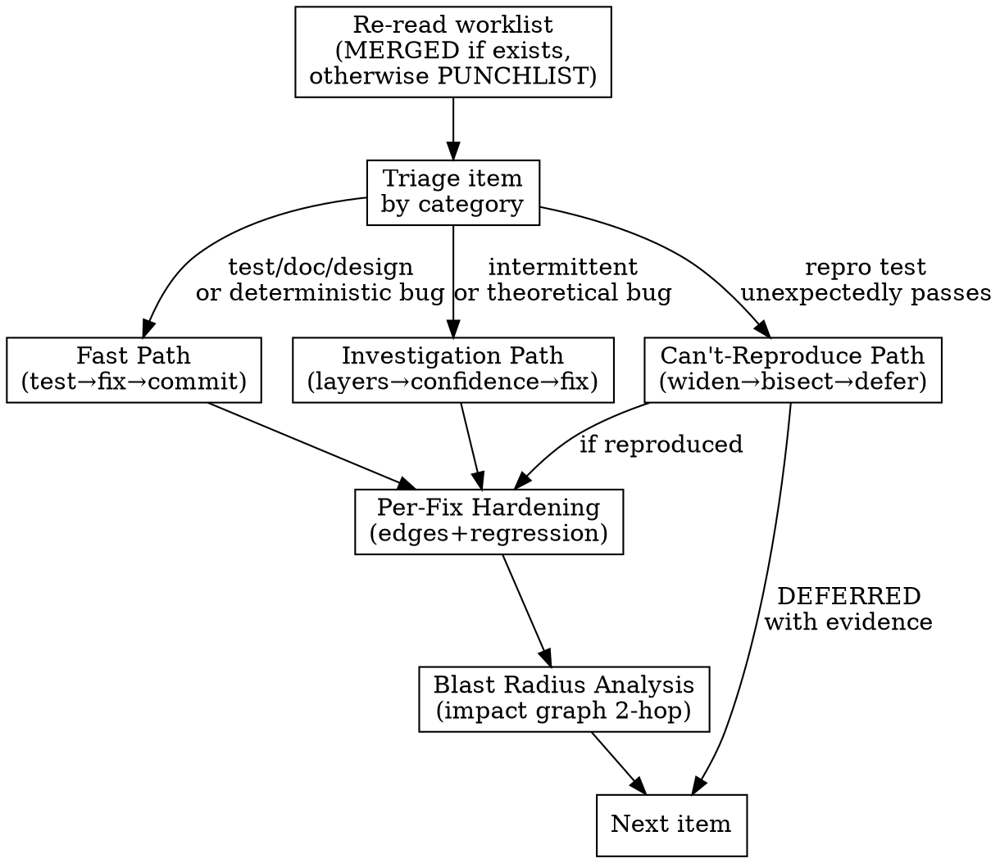

# Phase 4: Fix Loop (TDD) — Detailed Procedures

Read this file at the start of Phase 4. This file is shared by Holtz and Justine — the fix process is disciplined regardless of how findings were discovered.

## Triage Flowchart

## Triage Rules

- `test/*`, `doc/*`, `design/*` items → **Fast Path**
- `bug/*` items with determinism = deterministic → **Fast Path**
- `bug/*` items with determinism = intermittent or theoretical → **Investigation Path**
- Any item where the reproduction test unexpectedly passes → **Can't-Reproduce Path**

Commit format: `fix(<scope>): <desc>` with punchlist ID in body.

## Fast Path

For straightforward items where the root cause is obvious from the finding:

1. Write failing test. Verify it fails. Minimal fix. Full suite. Commit.
2. If mutation data exists from step 0e.1, re-run the mutation tool on the changed function(s) and record the before/after mutation kill rate in the punchlist item's Resolution notes (e.g., 'Mutation kill rate: 67% → 92%'). Quality check, not gate.
3. **Update PUNCHLIST.md with resolution IMMEDIATELY after each commit** (status, commit hash, validating test).
4. Update STATUS.md with last completed item ID. If this fix revealed a non-obvious insight, update the Strategy section's Last Insight field.

## Investigation Path

Use extended thinking (ultrathink) for this phase — root cause analysis through six abstraction layers requires deep reasoning.

For `bug/*` items where the root cause is not obvious, the bug is intermittent or theoretical, or multiple hypotheses need testing. See [investigation-format.md](investigation-format.md) for the investigation file format.

1. Create an investigation file and link it from the punchlist item's `**Investigation:**` field.
2. **Investigate bottom-up** through the layer stack:

   | Layer | Check |
   |-------|-------|
   | **Data** | Is the input what you think it is? Log actual values, types, shapes at entry point |
   | **Dependencies** | Are called systems working? DB connected, API reachable, file exists, permissions correct? |
   | **State** | Is state correct at each step? Add assertions/logging at intermediate points |
   | **Logic** | Does the code do what it says? Trace actual execution path, not intended one |
   | **Integration** | Do pieces work together? Boundary serialization, type mismatches, contract violations |
   | **Timing** | Race condition, async ordering, cache staleness, concurrency issue? |

   At each layer: form a specific, falsifiable hypothesis. Design the smallest check that confirms or refutes it. Run it. Record in the investigation file.

3. **For regressions:** use `git bisect` to find the breaking commit before investigating layers.
4. **Require HIGH confidence** before fixing. If confidence is LOW or MEDIUM, design one more check to raise it.
5. Once root cause is confirmed at HIGH confidence: write failing test, verify it fails, minimal fix, full suite, commit.
6. **Update punchlist** with resolution, root cause confidence, and commit hash IMMEDIATELY.
7. Update STATUS.md. Update the Strategy section's Last Insight with the root cause finding.

## Can't-Reproduce Path

When the reproduction test passes (bug not triggered), do NOT skip the item. Escalate:

1. **Widen conditions:** Try different inputs, orderings, timing, data sizes, concurrency levels
2. **Check environment:** Different OS, runtime version, dependency versions, config differences
3. **Statistical reproduction:** For intermittent bugs, run the test in a loop (100-1000x) and measure failure rate
4. **Git bisect:** If the behavior "used to work," find the breaking commit
5. **Add instrumentation:** If still not reproducible, add logging/tracing to capture state

Log every attempt in the investigation file. Failed reproduction attempts are evidence.

If not reproducible after structured attempts: mark the item DEFERRED with evidence. Do not silently drop it.

## Per-Fix Hardening

After each fix passes the reproduction test and full suite:

1. **Edge variants:** Does the fix handle null, empty, boundary, and concurrent cases? If not, write tests for them.
2. **Regression risk:** Could this specific fix regress? If the fix is in a path without existing test coverage, add a regression test beyond the reproduction test.
3. Run full suite again after any hardening tests are added.

This is per-fix robustness, not pattern analysis. Phase 5 looks across fixes for systemic issues.

## Blast Radius Analysis

After each fix passes the reproduction test, full suite, and per-fix hardening:

See [impact-graph-operations.md](impact-graph-operations.md) for the blast radius query commands and risk score update procedures.

1. **Identify** the changed function(s)/module(s)
2. **Query** the impact graph with `blast_radius` (depth 2, or depth 3 for architectural fixes)
3. **For each node in the blast radius:** check assumptions, update edges
4. **Update impact graph:** lower risk scores, add/update edges
5. **Update STATUS.md** Strategy section with blast radius findings
