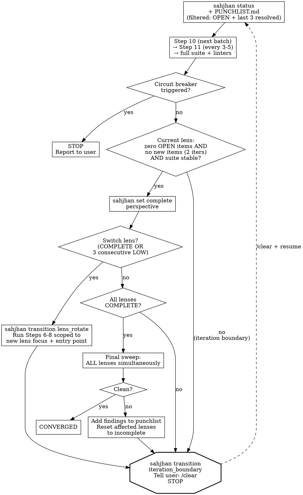

# Phase: Fix Loop (Steps 10-14)

> Core rules, rationalization red flags, and quick reference are in [../SKILL.md](../SKILL.md). Read that first if this is a fresh context.

### Step 10: TDD Fix Loop

Read [references/step-10-fix-loop.md](references/step-10-fix-loop.md) for the complete fix loop procedure (triage flowchart, fast path, investigation path, can't-reproduce path, per-fix hardening, blast radius analysis).

Read [references/impact-graph-operations.md](references/impact-graph-operations.md) for blast radius queries and risk score updates.

1. **Re-read worklist** — If `docs/holtz/PUNCHLIST-MERGED.md` exists, use it. Otherwise, use `docs/holtz/PUNCHLIST.md`. **If the punchlist has more than 6 items**, use filtered reads to reduce context load:
   ```bash
   python ${CLAUDE_PLUGIN_ROOT}/skills/holtz/scripts/validate_punchlist.py <punchlist-path> --filter-status OPEN "IN PROGRESS" RESOLVED --resolved-before 3 --render
   ```
   This shows all OPEN/IN PROGRESS items plus the 3 most recently resolved items (for cross-item pattern recognition). Items resolved earlier are on disk and available in Step 11.
2. **Triage** → Fast Path (test/doc/design/deterministic bug) | Investigation Path (intermittent/theoretical bug) | Can't-Reproduce Path (repro test passes)
3. After each fix: **Per-Fix Hardening** (edge variants, regression tests) → **Blast Radius Analysis** (impact graph 2-hop query, risk score updates)
4. Commit format: `fix(<scope>): <desc>` with punchlist ID in body
5. **Run `sahjhan transition fix_commit --item-id BH-NNN` IMMEDIATELY after each commit** — this records the fix, runs gate checks (test suite, blast radius, hardening), and updates the rendered punchlist.

### Step 11: Pattern Analysis [recurring: every 3-5 fixes during Step 10]

Use extended thinking (ultrathink) for this step — cross-finding pattern discovery and sibling search require deep reasoning.

1. **Re-read `docs/holtz/PUNCHLIST.md`** — For pattern analysis, read the full punchlist (no filter). Pattern grouping requires seeing all resolved items to identify shared root causes across the complete history.
2. Group resolved items by category. Also compare Discovery Chains across items — items in different categories but with similar chains may share a root cause. For groups of 2+: identify pattern, search for siblings, write new items to punchlist IMMEDIATELY
3. Write pattern blocks to punchlist per format spec
4. **Update impact graph:** Add `shares_pattern` edges between all instances of the same pattern (e.g., if BH-003 and BH-007 are both PAT-001 instances, link the functions they involve with `shares_pattern` edges including the pattern ID in the note).
5. **Record:** `sahjhan event pattern_analysis_complete --patterns_found N --siblings_found M`. Add new PAT-NNN entries to `docs/holtz/patterns-brief.md`.
6. **Update `docs/holtz/patterns-brief.md`:** Read `docs/holtz/patterns-brief.md` first (if it exists) to check for existing entries. For each newly identified pattern, append an entry to the patterns brief. Use this format:

   ```markdown
   ## PAT-{NNN}: {name} (Run {R}, {date})
   **What to look for:** {1-2 sentences: the specific code shape or practice that indicates this bug class}
   **Detection heuristic:** {grep pattern, structural check, or question to ask about the code}
   **Example:** {one concrete instance from a prior finding, anonymized to the pattern level}
   ```

   If the file does not exist, create it with this header:

   ```markdown
   # Holtz Pattern Brief

   > Read this before starting any audit work. These patterns were discovered
   > in prior audits of this project. Check for them in the code you're reviewing.
   ```

   **Deduplication:** Before appending, check if the new pattern is a refinement of an existing entry (same bug class, similar detection heuristic). If so, update the existing entry with improved heuristics or examples rather than adding a duplicate.

   **Rolling policy:** The brief is capped at 20 active entries. When a new pattern would push the count past 20, move the 5 oldest entries (by discovery date) in a single batch to `docs/holtz/patterns-brief-archive.md`. The archive uses the same format but is not read by subagents by default. If the archive file does not exist, create it with the same header but titled `# Holtz Pattern Brief — Archive`.

### Step 12: Per-Fix Hardening [recurring: after each fix in Step 10]

After each fix: edge case variants (null, empty, boundary, concurrent), regression tests for similar code paths.

### Step 13: Blast Radius Check [recurring: after each fix in Step 10]

After each fix: impact graph 2-hop query. Check downstream assumptions. If an assumption is violated, create a new punchlist item.

### Step 14: Lens Rotation

Read [references/lens-registry.md](references/lens-registry.md) for the full set of analytical lenses. The convergence loop rotates through lenses. True convergence requires ALL lenses clean in the same final sweep.

Re-run Steps 6-8 scoped to the current analytical lens. After completing, return to Step 10 (fix loop) for any new findings. When a perspective passes clean, run `sahjhan set complete perspective`. Then `sahjhan transition lens_rotate` to switch to the next perspective.

**Circuit Breakers:**
- **MAX_ITERATIONS:** 15 total fix-loop iterations. Enforced by Sahjhan's `fix_commit` gate (`max_count = 15`). After 15, the gate blocks — report remaining items to the user.
- **SAME_ITEM:** 3 attempts on the same punchlist item. After 3, escalate to the user.
- **NO_PROGRESS:** 3 consecutive iterations with no items resolved. Stop and report.
- **CONTEXT_BUDGET:** If context utilization exceeds 60%, wrap up the current item and proceed to the convergence boundary — run `sahjhan transition iteration_boundary` and instruct `/clear`. Do not wait for compaction.


