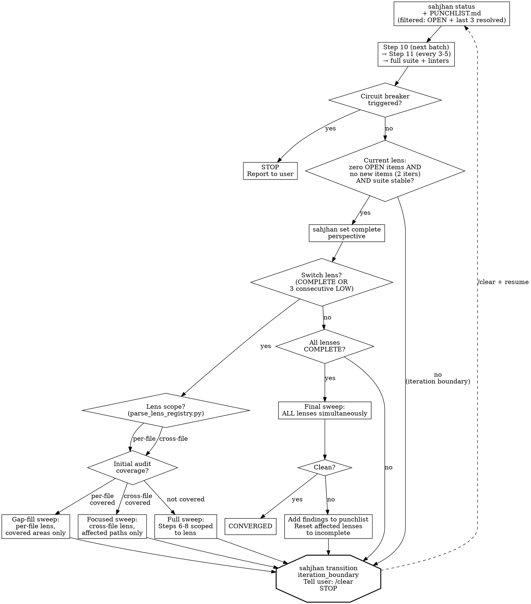

# Phase: Fix Loop (Steps 10-14)

> Core rules, rationalization red flags, and quick reference are in [../SKILL.md](../SKILL.md). Read that first if this is a fresh context.

<HARD-GATE>
Before entering the fix loop, read [references/step-10-fix-loop.md](references/step-10-fix-loop.md) and record:
`sahjhan --config-dir "$CLAUDE_PLUGIN_ROOT/enforcement" event reference_read --field path=step-10-fix-loop.md`
The `fix_loop_start` transition will not pass without this event.
</HARD-GATE>

<HARD-GATE>
**A context reset is mandatory between building the punchlist and the first fix.** `fix_loop_start` does **not** land you in `fix_loop` — it lands in `awaiting_clear`. The punchlist is now complete on disk; auditing it and fixing it are separate contexts. So:

1. Run `sahjhan --config-dir "$CLAUDE_PLUGIN_ROOT/enforcement" transition fix_loop_start` → you are now in `awaiting_clear`.
2. Tell the user to `/clear`. The turn stops; the daemon survives (it holds the session key). This is a context reset, **not** a stopping point — the run resumes after the clear.
3. After `/clear`, Claude Code fires a `SessionStart` that records the `context_reset` event, and the primer re-injects state on your next turn. **Re-read [references/step-10-fix-loop.md](references/step-10-fix-loop.md)** (your context was wiped) and the worklist from disk.
4. Run `sahjhan --config-dir "$CLAUDE_PLUGIN_ROOT/enforcement" transition resume` → now you are in `fix_loop`.

The `resume` gate requires a `context_reset` whose provenance is a real reset — `/clear`, a compaction, or a brand-new session. Nothing else can write one: it is not produced by sending a message, and a `--resume`/`--continue`/`/branch` session does not count, because those carry the old context forward. Talking your way past this gate is not available; the only way through is an actual reset (#79).

The same `awaiting_clear` boundary recurs mid-loop via `iteration_boundary` (Step 12). Entering fixes and resuming fixes use identical machinery.
</HARD-GATE>

### Step 10: TDD Fix Loop

Read [references/impact-graph-operations.md](references/impact-graph-operations.md) for blast radius queries and risk score updates.

**Re-read worklist** — If `docs/holtz/PUNCHLIST-MERGED.md` exists, use it. Otherwise, use `docs/holtz/PUNCHLIST.md`. **If the punchlist has more than 6 items**, use filtered reads to reduce context load:
```bash
python3 ${CLAUDE_PLUGIN_ROOT}/skills/holtz/scripts/validate_punchlist.py <punchlist-path> --filter-status OPEN "IN PROGRESS" RESOLVED --resolved-before 3 --render
```
This shows all OPEN/IN PROGRESS items plus the 3 most recently resolved items (for cross-item pattern recognition). Items resolved earlier are on disk and available in Step 11.

#### Per-Item Fix Procedure (MANDATORY — do not skip steps)

Fixes are **delegated to subagents; the orchestrator validates and commits.** You (the orchestrator) do not read a finding's code or author its test and fix in your own context — that is the subagent's job, and it is what keeps the main context under the ~300K budget (see SKILL.md → Context Survival Protocol). The subagent does the **whole TDD cycle in the enforced working tree** — writing the failing test, recording it, writing the fix, running the suite. You keep only the **git commits and the protocol-state transitions**; those stay linear in one place so subagents never race on the branch or the state machine.

**The subagent is under the same enforcement you are.** The hooks fire on a subagent's Bash/Edit exactly as they fire on yours — Claude Code adds an `agent_id` to the hook event but the TDD gate does not look at it. So the pre-edit hook physically stops the subagent from writing a source fix until it has recorded `test_failed_before_fix` since the last transition, and its `sahjhan event ...` calls write the same ledger you read. "Follow TDD" is not a request you make of the subagent in its prompt — it is mechanically unavoidable for it, just as it is for you. (This is why the subagent must run Sahjhan, not avoid it: recording the TDD events is exactly what unblocks its own edits.)

For EACH punchlist item, in order:

**Step A — Dispatch the fix subagent (investigate + author + verify, in-tree).**
Launch **one** Agent subagent for the finding. Give it: the finding (ID, description, location, category, Discovery Chain), which triage path it falls under (see [references/step-10-fix-loop.md](references/step-10-fix-loop.md)), the instruction to work **only** this finding, and `$CLAUDE_PLUGIN_ROOT` so it can invoke Sahjhan. The subagent runs the enforced TDD sequence itself, in the real tree:

1. `sahjhan --config-dir "$CLAUDE_PLUGIN_ROOT/enforcement" event fix_start --field finding_id=BH-NNN`
2. Write a failing test that reproduces the finding. Run it. Confirm it FAILS. (Files under `tests/**` are exempt from the pre-edit gate, so this write is allowed.)
3. `sahjhan --config-dir "$CLAUDE_PLUGIN_ROOT/enforcement" event test_failed_before_fix --field finding_id=BH-NNN --field test_name=...`
4. Write the fix. (The pre-edit hook now allows the source edit because step 3 is on the ledger.) Run the failing test. Confirm it PASSES.
5. Run full suite. Confirm all pass.
6. Run blast radius: `python3 ${CLAUDE_PLUGIN_ROOT}/skills/holtz/scripts/impact_graph.py --graph docs/holtz/impact-graph.json blast_radius <node> --depth 2`
7. `sahjhan --config-dir "$CLAUDE_PLUGIN_ROOT/enforcement" event blast_radius --field finding_id=BH-NNN --field affected_count=N`
8. Write ≥1 edge-case hardening test. Run it. Confirm it passes.
9. `sahjhan --config-dir "$CLAUDE_PLUGIN_ROOT/enforcement" event hardening_complete --field finding_id=BH-NNN --field edge_cases_tested=N`

The subagent returns a **compact result**, not artifacts to apply: root cause + confidence (`bug/*` needs HIGH confidence before any fix), the blast-radius node, the test name(s), and the suite pass-count. The edits and the ledger events are already on disk — that is the whole point. The subagent does **NOT** `git commit` and does **NOT** run any `transition`; those are yours.

If the subagent cannot reach HIGH confidence, it records nothing, leaves the tree clean, and returns its investigation notes plus a recommendation (defer-low / defer-medium / can't-reproduce with evidence). You then follow the deferral path in [references/step-10-fix-loop.md](references/step-10-fix-loop.md) — do not invent a fix.

**Step B — Orchestrator validates and commits.** You author and apply nothing. With the finding's work already in the tree and on the ledger:

10. **Validate the verification:** re-run the full suite and confirm it is green, and confirm the ledger shows this finding's `test_failed_before_fix` and `hardening_complete` for BH-NNN (`sahjhan --config-dir "$CLAUDE_PLUGIN_ROOT/enforcement" status`, or `sahjhan --config-dir "$CLAUDE_PLUGIN_ROOT/enforcement" ledger`). If the suite is red or those events are missing, the subagent's fix is not real — send it back or defer; do not commit.
11. `git commit` with finding ID in body. Format: `fix(<scope>): <desc>`
12. `sahjhan --config-dir "$CLAUDE_PLUGIN_ROOT/enforcement" transition fix_commit BH-NNN` — the item id is **positional** (`item_id=BH-NNN` also works); the CLI rejects `--item-id`. **This transition auto-records the `finding_resolved` event for BH-NNN** (id from the arg, commit hash from `HEAD`, run context inherited from the ledger). That resolution event — not the transition itself — is what marks the finding resolved for STATUS.md / PUNCHLIST.md "Resolved" counts and every downstream gate (`pattern_check`, `set complete perspective`, `converge`). You do **not** record `finding_resolved` by hand; one command does both. (Emitted by sahjhan ≥ 0.18.0; the pin is enforced by `scripts/check_sahjhan_pin.py`.)
13. Move to next item.

Dispatch subagents **one finding at a time** — the ledger is a single hash chain and commits land on one branch, so concurrent fix subagents would race on both. Because the subagent is gated by the **same** TDD pre-edit hook you are, it cannot write the fix (step 4) before recording `test_failed_before_fix` (step 3) — that hard guarantee is what lets you commit on its word after only re-running the suite.

**The subagent cannot do step 4 before step 3.** The pre-edit hook enforces this — on the subagent, exactly as it would on you.

#### Fix Loop Output Rules

**During the fix loop, do not write explanatory text between fixes.**
Your output should be:
- Tool calls (test writes, edits, bash commands)
- One-line status after each fix_commit: "FIX N/M: BH-NNN resolved. Suite: X pass."
- Nothing else until convergence.

If you find yourself writing a summary table, STOP. You are not in the finalize phase.

### Step 11: Pattern Analysis [recurring: every 3-5 fixes during Step 10]

Use extended thinking (ultrathink) for this step — cross-finding pattern discovery and sibling search require deep reasoning.

1. **Re-read `docs/holtz/PUNCHLIST.md`** — For pattern analysis, read the full punchlist (no filter). Pattern grouping requires seeing all resolved items to identify shared root causes across the complete history.
2. Group resolved items by category. Also compare Discovery Chains across items — items in different categories but with similar chains may share a root cause. For groups of 2+: identify pattern, search for siblings, write new items to punchlist IMMEDIATELY
3. Write pattern blocks to punchlist per format spec
4. **Update impact graph:** Add `shares_pattern` edges between all instances of the same pattern (e.g., if BH-003 and BH-007 are both PAT-001 instances, link the functions they involve with `shares_pattern` edges including the pattern ID in the note).
5. **Record:** `sahjhan --config-dir "$CLAUDE_PLUGIN_ROOT/enforcement" event pattern_analysis_complete --patterns_found N --siblings_found M`. Add new PAT-NNN entries to `docs/holtz/patterns-brief.md`.
6. **Update `docs/holtz/patterns-brief.md`:** Read `docs/holtz/patterns-brief.md` first (if it exists) to check for existing entries. For each newly identified pattern, append an entry to the patterns brief. Use this format:

   ```markdown
   ## PAT-{NNN}: {name} (Run {R}, {date})
   **What to look for:** {1-2 sentences: the specific code shape or practice that indicates this bug class}
   **Detection heuristic:** {grep pattern, structural check, or question to ask about the code}
   **Example:** {one concrete instance from a prior finding, anonymized to the pattern level}
   ```

   If the file does not exist, create it with this header:

   ```markdown
   # Holtz Pattern Brief

   > Read this before starting any audit work. These patterns were discovered
   > in prior audits of this project. Check for them in the code you're reviewing.
   ```

   **Deduplication:** Before appending, check if the new pattern is a refinement of an existing entry (same bug class, similar detection heuristic). If so, update the existing entry with improved heuristics or examples rather than adding a duplicate.

   **Rolling policy:** The brief is capped at 20 active entries. When a new pattern would push the count past 20, move the 5 oldest entries (by discovery date) in a single batch to `docs/holtz/patterns-brief-archive.md`. The archive uses the same format but is not read by subagents by default. If the archive file does not exist, create it with the same header but titled `# Holtz Pattern Brief — Archive`.

### Step 12: Per-Fix Hardening [recurring: after each fix in Step 10]

After each fix: edge case variants (null, empty, boundary, concurrent), regression tests for similar code paths.

### Step 13: Blast Radius Check [recurring: after each fix in Step 10]

After each fix: impact graph 2-hop query. Check downstream assumptions. If an assumption is violated, create a new punchlist item.

### Step 14: Lens Rotation

Read [references/lens-registry.md](references/lens-registry.md) for the full set of analytical lenses. The convergence loop rotates through lenses. True convergence requires ALL lenses clean in the same final sweep.

**Determine sweep strategy per lens.** Run `python3 ${CLAUDE_PLUGIN_ROOT}/skills/holtz/scripts/parse_lens_registry.py` and read `docs/holtz/audit/lens-coverage.md` (written after Steps 7-8). The sweep strategy depends on lens scope and initial audit coverage:

| Scope | Initial Coverage | Sweep Strategy |
|-------|-----------------|----------------|
| per-file | covered | **Gap-fill:** Audit only files not covered in initial audit (new files, files changed by fixes, files missed by subagent batching). Record `sweep_type=gap-fill`. |
| per-file | not covered | **Full:** Standard Steps 6-8 scoped to this lens. Record `sweep_type=full`. |
| cross-file | covered | **Focused:** Re-trace entry points from lens registry using updated impact graph. Focus on paths affected by fixes since initial audit. Record `sweep_type=cross-file-focused`. |
| cross-file | not covered | **Full:** Standard Steps 6-8 scoped to this lens entry point. Record `sweep_type=full`. |

For each lens sweep, record: `sahjhan --config-dir "$CLAUDE_PLUGIN_ROOT/enforcement" event lens_sweep_started --field perspective={lens} --field sweep_type={type}`

**Gap-fill sweep procedure (per-file lenses with initial coverage):**
1. Read `docs/holtz/audit/lens-coverage.md` for which files were covered
2. Identify gaps: files created/modified since initial audit (`git diff --name-only` from audit commit), plus any files not in subagent batches
3. Dispatch a subagent with the gap files and the lens's audit priorities
4. Write findings to `docs/holtz/audit/lens-{name}.md`

**Focused sweep procedure (cross-file lenses with initial coverage):**
1. Read the lens's initial audit output at `docs/holtz/audit/lens-{name}.md`
2. Query impact graph for edges relevant to this lens's entry point
3. Focus on paths that include nodes modified by fixes since the initial audit
4. Dispatch a subagent with the focused path list and lens audit priorities
5. Write findings to `docs/holtz/audit/lens-{name}.md` (append or replace)

After completing a lens sweep (any type), return to Step 10 (fix loop) for any new findings. When a perspective passes clean, run `sahjhan --config-dir "$CLAUDE_PLUGIN_ROOT/enforcement" set complete perspective`. Then run `sahjhan --config-dir "$CLAUDE_PLUGIN_ROOT/enforcement" transition lens_rotate` to switch to the next perspective.

**Circuit Breakers:**
- **MAX_ITERATIONS:** 15 fixes **per iteration window**. Enforced by Sahjhan's `fix_commit` circuit-breaker gate, which counts `fix_commit`s *since the last `iteration_boundary`* — so the cap resets at each `/clear`. If a single uncleared window hits 15, run `iteration_boundary` + `/clear` to continue (or report remaining items). Whole-run convergence is **not** capped: a long audit fixes >15 findings across multiple windows (fixed in #67; a prior lifetime cap made >15-finding audits unconvergeable).
- **SAME_ITEM:** 3 attempts on the same punchlist item. After 3, escalate to the user.
- **NO_PROGRESS:** 3 consecutive iterations with no items resolved. Stop and report.
- **CONTEXT_BUDGET:** If context utilization exceeds 60%, wrap up the current item and proceed to the convergence boundary — run `sahjhan --config-dir "$CLAUDE_PLUGIN_ROOT/enforcement" transition iteration_boundary` and instruct `/clear`. Do not wait for compaction.

**Test / lint command for non-standard targets.** The `fix_commit`, perspective-completion, and `converge` gates run the target project's suite and linter. These commands run **in the environment that invoked `sahjhan transition`**, so the interpreter resolves via your current `PATH`. If the target's tests only run under a venv/pyenv/conda/poetry/tox (i.e. the login `python3`/`ruff` isn't the right one), export an override **once at run start** — it flows to every gate:

```bash
export HOLTZ_PYTEST='.venv/bin/python -m pytest --tb=short -q'   # or: poetry run pytest / tox / python3.12 -m pytest ...
export HOLTZ_LINT='.venv/bin/ruff check .'                       # or: poetry run ruff check .
```

Unset, the gates default to `python3 -m pytest --tb=short -q` and `ruff check .` (unchanged behavior). When a gate command fails, Sahjhan now surfaces a tail of its stderr in the block reason (e.g. `No module named pytest`), so a missing interpreter is distinguishable from a real test failure (sahjhan ≥ 0.16.0, holtz #63).


