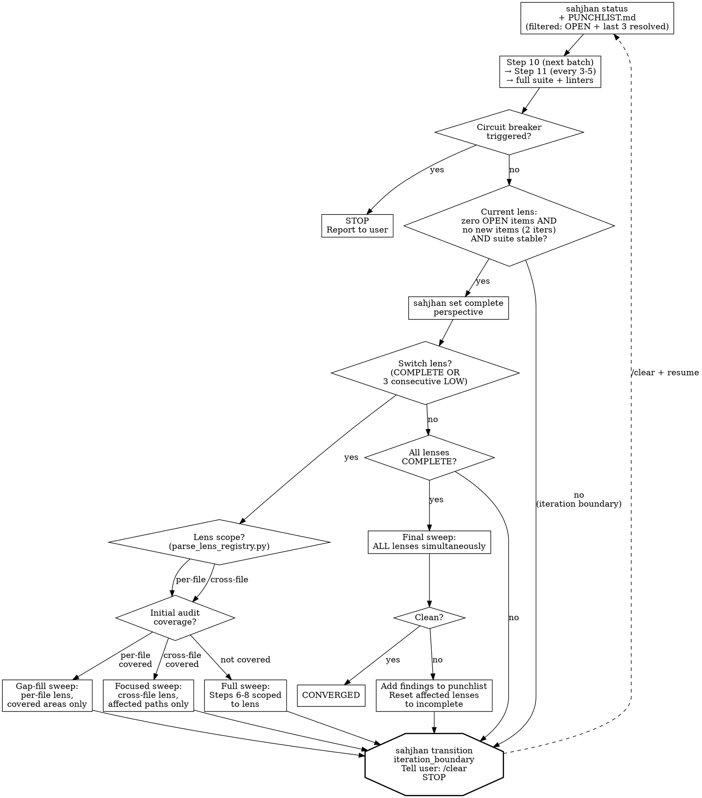

# Phase: Fix Loop (Steps 10-14)

> Core rules, rationalization red flags, and quick reference are in [../SKILL.md](../SKILL.md). Read that first if this is a fresh context.

<HARD-GATE>
Before entering the fix loop, read [references/step-10-fix-loop.md](references/step-10-fix-loop.md) and record:
`sahjhan --config-dir "$CLAUDE_PLUGIN_ROOT/enforcement" event reference_read --field path=step-10-fix-loop.md`
The `fix_loop_start` transition will not pass without this event.
</HARD-GATE>

### Step 10: TDD Fix Loop

Read [references/impact-graph-operations.md](references/impact-graph-operations.md) for blast radius queries and risk score updates.

**Re-read worklist** — If `docs/holtz/PUNCHLIST-MERGED.md` exists, use it. Otherwise, use `docs/holtz/PUNCHLIST.md`. **If the punchlist has more than 6 items**, use filtered reads to reduce context load:
```bash
python3 ${CLAUDE_PLUGIN_ROOT}/skills/holtz/scripts/validate_punchlist.py <punchlist-path> --filter-status OPEN "IN PROGRESS" RESOLVED --resolved-before 3 --render
```
This shows all OPEN/IN PROGRESS items plus the 3 most recently resolved items (for cross-item pattern recognition). Items resolved earlier are on disk and available in Step 11.

#### Per-Item Fix Procedure (MANDATORY — do not skip steps)

For EACH punchlist item, in order:

1. `sahjhan --config-dir "$CLAUDE_PLUGIN_ROOT/enforcement" event fix_start --field finding_id=BH-NNN`
2. Write a failing test. Run it. Confirm it FAILS.
3. `sahjhan --config-dir "$CLAUDE_PLUGIN_ROOT/enforcement" event test_failed_before_fix --field finding_id=BH-NNN --field test_name=...`
4. Write the fix. Run the failing test. Confirm it PASSES.
5. Run full suite. Confirm all pass.
6. Run blast radius: `python3 ${CLAUDE_PLUGIN_ROOT}/skills/holtz/scripts/impact_graph.py --graph docs/holtz/impact-graph.json blast_radius <node> --depth 2`
7. `sahjhan --config-dir "$CLAUDE_PLUGIN_ROOT/enforcement" event blast_radius --field finding_id=BH-NNN --field affected_count=N`
8. Write edge-case hardening tests (minimum 1).
9. `sahjhan --config-dir "$CLAUDE_PLUGIN_ROOT/enforcement" event hardening_complete --field finding_id=BH-NNN --field edge_cases_tested=N`
10. `git commit` with finding ID in body. Format: `fix(<scope>): <desc>`
11. `sahjhan --config-dir "$CLAUDE_PLUGIN_ROOT/enforcement" transition fix_commit --item-id BH-NNN`
12. Move to next item.

**You cannot do step 4 before step 3.** The pre-edit hook enforces this.

#### Fix Loop Output Rules

**During the fix loop, do not write explanatory text between fixes.**
Your output should be:
- Tool calls (test writes, edits, bash commands)
- One-line status after each fix_commit: "FIX N/M: BH-NNN resolved. Suite: X pass."
- Nothing else until convergence.

If you find yourself writing a summary table, STOP. You are not in the finalize phase.

### Step 11: Pattern Analysis [recurring: every 3-5 fixes during Step 10]

Use extended thinking (ultrathink) for this step — cross-finding pattern discovery and sibling search require deep reasoning.

1. **Re-read `docs/holtz/PUNCHLIST.md`** — For pattern analysis, read the full punchlist (no filter). Pattern grouping requires seeing all resolved items to identify shared root causes across the complete history.
2. Group resolved items by category. Also compare Discovery Chains across items — items in different categories but with similar chains may share a root cause. For groups of 2+: identify pattern, search for siblings, write new items to punchlist IMMEDIATELY
3. Write pattern blocks to punchlist per format spec
4. **Update impact graph:** Add `shares_pattern` edges between all instances of the same pattern (e.g., if BH-003 and BH-007 are both PAT-001 instances, link the functions they involve with `shares_pattern` edges including the pattern ID in the note).
5. **Record:** `sahjhan --config-dir "$CLAUDE_PLUGIN_ROOT/enforcement" event pattern_analysis_complete --patterns_found N --siblings_found M`. Add new PAT-NNN entries to `docs/holtz/patterns-brief.md`.
6. **Update `docs/holtz/patterns-brief.md`:** Read `docs/holtz/patterns-brief.md` first (if it exists) to check for existing entries. For each newly identified pattern, append an entry to the patterns brief. Use this format:

   ```markdown
   ## PAT-{NNN}: {name} (Run {R}, {date})
   **What to look for:** {1-2 sentences: the specific code shape or practice that indicates this bug class}
   **Detection heuristic:** {grep pattern, structural check, or question to ask about the code}
   **Example:** {one concrete instance from a prior finding, anonymized to the pattern level}
   ```

   If the file does not exist, create it with this header:

   ```markdown
   # Holtz Pattern Brief

   > Read this before starting any audit work. These patterns were discovered
   > in prior audits of this project. Check for them in the code you're reviewing.
   ```

   **Deduplication:** Before appending, check if the new pattern is a refinement of an existing entry (same bug class, similar detection heuristic). If so, update the existing entry with improved heuristics or examples rather than adding a duplicate.

   **Rolling policy:** The brief is capped at 20 active entries. When a new pattern would push the count past 20, move the 5 oldest entries (by discovery date) in a single batch to `docs/holtz/patterns-brief-archive.md`. The archive uses the same format but is not read by subagents by default. If the archive file does not exist, create it with the same header but titled `# Holtz Pattern Brief — Archive`.

### Step 12: Per-Fix Hardening [recurring: after each fix in Step 10]

After each fix: edge case variants (null, empty, boundary, concurrent), regression tests for similar code paths.

### Step 13: Blast Radius Check [recurring: after each fix in Step 10]

After each fix: impact graph 2-hop query. Check downstream assumptions. If an assumption is violated, create a new punchlist item.

### Step 14: Lens Rotation

Read [references/lens-registry.md](references/lens-registry.md) for the full set of analytical lenses. The convergence loop rotates through lenses. True convergence requires ALL lenses clean in the same final sweep.

**Determine sweep strategy per lens.** Run `python3 ${CLAUDE_PLUGIN_ROOT}/skills/holtz/scripts/parse_lens_registry.py` and read `docs/holtz/audit/lens-coverage.md` (written after Steps 7-8). The sweep strategy depends on lens scope and initial audit coverage:

| Scope | Initial Coverage | Sweep Strategy |
|-------|-----------------|----------------|
| per-file | covered | **Gap-fill:** Audit only files not covered in initial audit (new files, files changed by fixes, files missed by subagent batching). Record `sweep_type=gap-fill`. |
| per-file | not covered | **Full:** Standard Steps 6-8 scoped to this lens. Record `sweep_type=full`. |
| cross-file | covered | **Focused:** Re-trace entry points from lens registry using updated impact graph. Focus on paths affected by fixes since initial audit. Record `sweep_type=cross-file-focused`. |
| cross-file | not covered | **Full:** Standard Steps 6-8 scoped to this lens entry point. Record `sweep_type=full`. |

For each lens sweep, record: `sahjhan --config-dir "$CLAUDE_PLUGIN_ROOT/enforcement" event lens_sweep_started --field perspective={lens} --field sweep_type={type}`

**Gap-fill sweep procedure (per-file lenses with initial coverage):**
1. Read `docs/holtz/audit/lens-coverage.md` for which files were covered
2. Identify gaps: files created/modified since initial audit (`git diff --name-only` from audit commit), plus any files not in subagent batches
3. Dispatch a subagent with the gap files and the lens's audit priorities
4. Write findings to `docs/holtz/audit/lens-{name}.md`

**Focused sweep procedure (cross-file lenses with initial coverage):**
1. Read the lens's initial audit output at `docs/holtz/audit/lens-{name}.md`
2. Query impact graph for edges relevant to this lens's entry point
3. Focus on paths that include nodes modified by fixes since the initial audit
4. Dispatch a subagent with the focused path list and lens audit priorities
5. Write findings to `docs/holtz/audit/lens-{name}.md` (append or replace)

After completing a lens sweep (any type), return to Step 10 (fix loop) for any new findings. When a perspective passes clean, run `sahjhan --config-dir "$CLAUDE_PLUGIN_ROOT/enforcement" set complete perspective`. Then run `sahjhan --config-dir "$CLAUDE_PLUGIN_ROOT/enforcement" transition lens_rotate` to switch to the next perspective.

**Circuit Breakers:**
- **MAX_ITERATIONS:** 15 total fix-loop iterations. Enforced by Sahjhan's `fix_commit` gate (`max_count = 15`). After 15, the gate blocks — report remaining items to the user.
- **SAME_ITEM:** 3 attempts on the same punchlist item. After 3, escalate to the user.
- **NO_PROGRESS:** 3 consecutive iterations with no items resolved. Stop and report.
- **CONTEXT_BUDGET:** If context utilization exceeds 60%, wrap up the current item and proceed to the convergence boundary — run `sahjhan --config-dir "$CLAUDE_PLUGIN_ROOT/enforcement" transition iteration_boundary` and instruct `/clear`. Do not wait for compaction.


